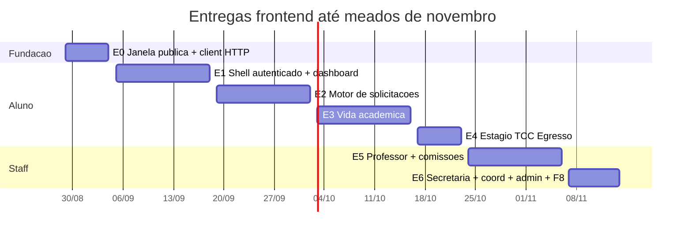

# Plano de entregas — Frontend Web + Mobile

**Este arquivo é a cópia canônica.** Ponteiro em `tutor/plano-entregas-frontend.md`.

**Público:** equipe de frontend (React web + React Native / Expo)  
**Horizonte:** 29/08/2026 → **meados de novembro/2026** (~11 semanas)  
**Primeira demo:** **4 de setembro de 2026** (sprint curta)  
**Premissa:** o backend já cobre os 10 perfis de `transaçõesBackend/`. O frontend ainda não existe. Este documento define **o que entregar em cada data**, **por quê**, **em que ordem** e **quais estruturas** criar — sem detalhar componentes tela a tela (isso fica com a equipe).

**Fontes de verdade (não improvisar contrato):**

| Camada | Onde ler |
|--------|----------|
| **Contrato API as-built** (ganha de HUs antigas) | `foundationDocs/analysis/as-built-backend.md` |
| O que o back realmente faz (tutoriais) | `transaçõesBackend/README.md` + pastas `F0`…`F8` |
| Rotas de UI (~46) | `foundationDocs/analysis/telas.md` |
| HUs por perfil | `foundationDocs/HUs/` |
| Motor de solicitações (front) | `frontend-web/docs/GUIA_IMPLEMENTACAO_WORKFLOW_ENGINE.md` |
| Blueprint visual | DashboardA (Versão A) — ignorar B/C |
| Camadas do back | `tutor/fluxo-informacional-camadas.md` |

---

## 1. Como ler este plano

Cada entrega é um **incremento utilizável**: usuário real (ou seed) percorre um fluxo de ponta a ponta contra a API, com testes e integração front↔back. Não entregamos “telas estáticas”. Não entregamos “só estrutura de pastas” depois da E0.

A ordem **não** é “um perfil por vez no sentido F0→F8”. É **dependência + reuso**:

1. Sem cookies/CSRF não há nada autenticado.
2. Sem shell + dashboard aluno não há produto.
3. Sem o **motor genérico de solicitações** (3 telas) o professor e a secretaria não deliberam — seriam 19 formulários duplicados.
4. Professor e comissões **reusam** as telas de solicitações/formativas/estágio.
5. Secretaria/admin são web-first e entram depois que o motor existe.

**UI cega a perfil.** Botões existem só se `_links` vier na resposta. Proibido `if (role === 'SECRETARIO')`. `_links` (e o `_link` singular das pendências do dashboard) são **strings** — não HAL `{ href }`.

---

## 2. O que o backend já entrega (resumo para o front)

Tudo abaixo está **implementado** no Kotlin. O front consome; não reimplementa regra.

| Perfil (`transaçõesBackend`) | O que o back já faz | Endpoints-âncora |
|------------------------------|---------------------|------------------|
| **F0 Público** | Login cookies HttpOnly, refresh rotativo, CSRF, forgot/reset, contato, erros RFC 7807, protocolo e certificado públicos, JWKS | `/auth/*`, `/publico/*`, `/.well-known/jwks.json` |
| **F1 Aluno** | BFF dashboard, primeiro acesso, perfil, hub, motor de requests + anexos MinIO, formativas, estágio, TCC, presença QR/PIN, certificados, atendimentos | `/bff/dashboard/aluno`, `/me`, `/requests`, `/formativas`, `/events`, `/certificates` |
| **F2 Egresso** | Dashboard BFF read-only (`alumni.view_own`) | `/bff/dashboard/egresso` |
| **F3 Professor** | Dashboard, CRUD eventos + operação de janelas, deliberar requests, revisar formativas, estágio/TCC, publicar comunicado | `/bff/dashboard/professor`, `/events`, `/requests/{id}/transitions` |
| **F4 Comissões** | Pool CAAF (claim/batch) e COE (supervisor/bulk) | `/commissions/caaf`, `/commissions/coe` |
| **F5 Secretaria** | Dashboard, fila, bulk-deliberate, alunos, diplomas, CSV import/export, stats, kanban, atendimentos | `/bff/dashboard/secretaria`, `/requests`, `/usuarios`, `/tasks`, `/reports/secretary` |
| **F6 Coordenação** | Config de curso + relatório | `/courses/{id}/config`, `/reports/coordinator` |
| **F7 Admin** | Usuários, roles, editor RequestType, templates, outbox, audit | `/admin/roles`, `/request-types`, `/admin/outbox`, `/audit` |
| **F8 Cross-cutting** | Busca global FGAC, FAQ + tickets | `/search`, `/faq`, `/support` |
| **Transversal** | Outbox, FCM, Redis sessão fail-closed, certificados Ed25519 | não são telas — o front só sente o efeito (e-mail, push, 401 pós-logout) |

SPA React e Expo estão **fora do recorte do back** (ver `transaçõesBackend/README.md`). CORS já prevê `http://localhost:5173` (Vite) e `http://localhost:3000`.

---

## 3. Stack 2026 — compatível com o back (não reinventar o ADR)

O projeto já fechou contratos. Usar o que o mercado usa **em 2026**, desde que **não quebre** cookies HttpOnly, CSRF Double Submit, HATEOAS e RFC 7807.

### 3.1 Web (`frontend-web/`)

| Peça | Escolha | Por quê (2026 + este back) |
|------|---------|----------------------------|
| UI | **React 18** (ADR do repo). React 19 Compiler é opcional depois; não bloquear a E0 | Concurrent + Suspense já bastam |
| Bundler | **Vite 6+** na porta **5173** | já está em `app.cors.allowed-origins` |
| Linguagem | TypeScript 5 **strict** | alinhado ao OpenAPI gerado |
| Rotas | **React Router 6** (`createBrowserRouter` + lazy) | `telas.md` já usa esse padrão |
| Server state | **TanStack Query v5** (query key factory) | dashboards BFF, invalidação pós-mutação |
| Client state | quase nada; **Zustand v5** só para sessão/UI (sidebar, theme) | mercado 2026: Query ≠ Redux |
| Forms | **React Hook Form 7 + Zod 4** + `@hookform/resolvers` | login, wizard, JSON Schema → Zod |
| HTTP | `fetch` ou axios com `credentials: 'include'` | cookies HttpOnly; **tokens nunca no JSON** |
| UI kit | **shadcn/ui + Radix + Tailwind** (tokens CSS, zero hex) | DashboardA |
| HATEOAS | hook `useActions(resource)` em `shared/api` — `_links: Record<string, string>` | lei do produto; sem HAL `{ href }` |
| Tipos | `openapi-typescript` a partir do SpringDoc `/v3/api-docs` | o back já expõe Swagger |
| Testes | Vitest + Testing Library + **Playwright** | E2E contra API real em docker |
| Mocks | **MSW** só para Storybook/dev sem back; E2E não usa mock de auth | |

Não adotar: Next.js App Router (o back já é o BFF), tRPC, Redux, localStorage de JWT.

### 3.2 Mobile (`mobile/`)

| Peça | Escolha | Por quê |
|------|---------|---------|
| Runtime | **Expo SDK 53/54 managed** + New Architecture | padrão 2026; EAS Build |
| Rotas | **Expo Router** (file-based, grupos `(auth)` / `(app)`) | espelha `telas.md` |
| Estilo | **NativeWind v4** com **os mesmos tokens** do web | um design system, duas plataformas |
| Server state | **TanStack Query v5** (mesmas query keys, clientes diferentes) | |
| Forms | RHF + Zod (compartilhar schemas via pasta compartilhada se possível) | |
| Tokens | **`expo-secure-store`** (Keychain/Keystore). Nunca AsyncStorage | o back não devolve JWT no body — ver §5 |
| Listas | **FlashList** (`@shopify/flash-list`) | filas longas |
| QR | `expo-camera` (Barcode) | presença F1.18 / F3.2 |
| Push | `expo-notifications` → `POST /me/fcm-token` `{ fcmToken, plataforma }` (unregister: `DELETE /me/fcm-token`) | transversal 10.5 |
| Offline | AsyncStorage **só rascunho de formulário** (não senha/token) | |
| Testes | RNTL + Maestro (fluxo login → dashboard) | |

Mobile **não** replica secretaria/admin/coordenação. Ver matriz §7.

### 3.3 Arquitetura limpa no front (o que o mercado chama de “screaming / feature-sliced”)

Três camadas, iguais no web e no mobile:

```
shared/     → kernel: HTTP, CSRF, Problem+JSON, HATEOAS, tokens, DS
features/   → um bounded context por pasta (auth, dashboard, solicitacoes, …)
app/        → composição: rotas, providers, layout
```

Regras (iguais ao back):

- `features/A` **não importa** `features/B`. Compartilhar só via `shared/`.
- Página não chama `fetch` direto — só hooks (`useLogin`, `useRequests`).
- Hook não conhece cor/spacing — só dados.
- Widget DS não conhece endpoint.
- **Não** criar `SegundaChamadaPage.tsx`. Um `DynamicForm` lê `form_schema`.

---

## 4. Estrutura de pastas (abstrata — a equipe preenche)

O detalhe de cada componente fica com vocês. Isto é o **esqueleto obrigatório** para as duas plataformas não divergirem.

### 4.1 Web

```
frontend-web/
  src/
    app/
      main.tsx
      providers.tsx          # QueryClient, Theme, AuthSession
      router.tsx             # rotas públicas + AuthGuard + AppLayout
    shared/
      api/
        client.ts            # credentials, CSRF, refresh 401, Problem+JSON
        hateoas.ts           # useActions
        problem.ts           # mapeia RFC 7807 → UI
        queryKeys.ts         # fábricas por recurso
        types/               # gerados do OpenAPI
      auth/
        session.ts           # mustChangePassword, mustAcceptLgpd (não o JWT)
        AuthGuard.tsx
        FirstAccessGuard.tsx
      tokens/tokens.css      # CSS variables (Figma → code)
      ui/                    # DS: Button, Input, Card, KpiCard, EmptyState, Skeleton…
    features/
      publico/               # login, recuperar, nova-senha, contato, erro, verificadores
      dashboard/
      perfil/
      comunicacao/
      solicitacoes/          # DynamicForm, wizard, detalhe, action bar HATEOAS
      formativas/
      estagio/
      tcc/
      eventos/
      certificados/
      atendimentos/
      secretaria/            # só web
      coordenacao/           # só web
      admin/                 # só web
      busca/
      suporte/
    test/
      e2e/                   # Playwright
      msw/
  index.html
  vite.config.ts
  tailwind.config.ts
```

Layout autenticado (espelhar DashboardA, não inventar shell):

```
AppLayout
  Sidebar (NavItem só para rotas cuja capability o BFF/_links permitir — ou nav mínima + esconder o resto)
  Main
    Topbar (título, busca Ctrl+K a partir da E6, sino, avatar)
    PageContent
```

### 4.2 Mobile

```
mobile/
  app/
    _layout.tsx              # providers
    (publico)/
      login.tsx
      recuperar-senha.tsx
      nova-senha.tsx
      erro.tsx
    (app)/
      _layout.tsx            # tabs: Início | Solicitações | Eventos | Avisos | Perfil
      inicio.tsx
      solicitacoes/{index,nova,[id]}.tsx
      formativas/…
      eventos/{index,[id],presenca}.tsx
      certificados.tsx
      comunicacao.tsx
      perfil/…
  src/
    shared/                  # espelho do web: client, hateoas, tokens, ui NativeWind
    features/                # mesmos nomes do web; implementação nativa
  app.json
  eas.json
```

### 4.3 Design (abstrato)

- Tokens: `brand`, `surface`, `text`, `border`, `success|warning|danger|info`, `space-*`, `radius-*`.
- Toda lista tem **loading (Skeleton)**, **vazio (EmptyState)**, **erro (AlertBanner + incidentId se 5xx)**.
- Contraste WCAG AA; foco visível; não usar cor sozinha para status.
- Dashboard **Versão A** é o único blueprint de densidade/espaçamento.

---

## 5. Contrato de integração (ler antes de escrever a primeira linha)

Isto é o que mais quebra time de front se for ignorado.

### 5.1 Cookies (web)

`POST /auth/login` **não** devolve JWT no JSON. Só:

```json
{ "mustChangePassword": false, "mustAcceptLgpd": false }
```

Tokens vão em `Set-Cookie`:

| Cookie | Path | Uso |
|--------|------|-----|
| `access_token` | `/` | 15 min, HttpOnly |
| `refresh_token` | `/auth` | 7 dias, HttpOnly, só `/auth/*` |

Cliente web: `credentials: 'include'` em **todas** as chamadas. Dev local: backend com `COOKIE_SECURE=false` (default do YAML é `true` — cookies não gravam em HTTP). CORS: origem exata `http://localhost:5173`, `allowCredentials: true`.

### 5.2 CSRF (Double Submit)

Mutações (`POST`/`PATCH`/`PUT`/`DELETE`) autenticadas e `POST /publico/contato` exigem header `X-XSRF-TOKEN` igual ao cookie `XSRF-TOKEN` (lógico, o SPA lê).

```
GET /auth/csrf  →  { token, headerName: "X-XSRF-TOKEN" }  + cookie
```

**Isentos:** login, refresh, ott, forgot-password, reset-password.

O `client.ts` deve: ao boot (e após 403 CSRF) chamar `/auth/csrf`; injetar o header em toda mutação.

### 5.3 Refresh e 401

Access expira em 15 min. Interceptor:

1. 401 em rota autenticada → `POST /auth/refresh` (cookie de refresh vai sozinho, path `/auth`).
2. Sucesso → retry da request original.
3. Falha → limpar sessão client-side, ir para `/login`.

Logout: `POST /auth/logout` (precisa CSRF) → cookies zerados + Redis mata `sid` na hora.

### 5.4 Mobile ≠ cookie jar de browser

React Native **não** persiste HttpOnly como o Chrome. Estratégia alinhada ao filtro JWT (cookie **ou** `Authorization: Bearer`):

1. No login, ler `Set-Cookie` da resposta (o CORS expõe `Set-Cookie`) **ou** usar um cookie manager nativo.
2. Guardar access + refresh no **SecureStore**.
3. Enviar `Authorization: Bearer <access>` nas APIs.
4. Refresh: `POST /auth/refresh` enviando o cookie `refresh_token` manualmente **ou** o header Cookie montado.
5. CSRF: mobile também chama `GET /auth/csrf` e ecoa `X-XSRF-TOKEN` nas mutações (o filtro CSRF não distingue plataforma).

Não guardar JWT em AsyncStorage. Não logar tokens.

### 5.5 Erros — RFC 7807

`Content-Type: application/problem+json`:

```json
{ "type": "https://secretariaonline.ufpr.br/errors/…", "title": "", "status": 401, "detail": "", "instance": "" }
```

5xx trazem `incidentId` (`INC-yyyy-xxxx`) — a tela `/erro/:codigo` **mostra** esse id para suporte. 401 de login é mensagem genérica (anti-enumeração). 429 traz `Retry-After` / `retryAfterSeconds`.

### 5.6 Primeiro acesso e deep-link professor

- Login com `mustChangePassword: true` → única rota liberada: `/primeiro-acesso` → `POST /auth/first-access` `{ novaSenha, aceiteLgpd }` (autenticado + CSRF).
- E-mail de deliberação: query `?ott=` → `POST /auth/ott` `{ token }` → cookies de sessão → tela da solicitação.

### 5.7 Senha (espelhar o back na UX, o back revalida)

Mínimo 12, maiúscula, minúscula, dígito, especial. Reuso das 3 últimas → 422 `password-reuse`. Token de reset já usado → 401 genérico.

### 5.8 Upload MinIO (solicitações / formativas / estágio / TCC)

Nunca mandar o arquivo pelo Spring. Fluxo: presign → PUT no MinIO → `confirm` com SHA-256 do cliente. Detalhe no guia do workflow engine.

---

## 6. Complexidade dos 10 blocos (por que o tempo não é igual)

Unidade: **peso relativo** (1 ≈ uma semana de um time de front focado, com back estável). Soma ~11, cabe no calendário se houver **reuso brutal**.

| Bloco | Peso | Por quê é caro / barato | Plataforma |
|-------|------|-------------------------|------------|
| Fundação (repo, client, DS mínimo) | incluso na E0 | custo fixo; se falhar, todas as sprints atrasam | ambas |
| **F0** (reduzido na E0, completo na E1) | 0,8 | login/CSRF é o risco técnico; páginas GET são baratas | web completa; mobile: auth + erro |
| **F1 shell + dashboard + perfil** | 1,7 | AppLayout, guards, BFF uma chamada, primeiro acesso | ambas |
| **F1 solicitações (motor)** | **2,0** | peça mais cara: JSON Schema, wizard, anexos, HATEOAS | ambas |
| **F1 vida acadêmica** (hub, formativas, presença, cert, atendimentos) | 1,7 | presença tem 4 modos; QR é nativo | ambas (QR melhor no mobile) |
| **F1 estágio/TCC + F2** | 0,8 | CRUD + upload já padronizado; egresso é dashboard fino | ambas |
| **F3 + F4** | 1,7 | operação de evento (QR/PIN ao vivo) é nova UI; deliberação **reusa** o motor | web+mobile prof.; F4 web (e tab mobile se couber) |
| **F5 + F6** | 1,6 | muitos ecrãs, mas tabela + filtros + motor já existe; import CSV é form+job | **web** |
| **F7 + F8** | 0,7 | CRUD admin + command palette; editor de schema pode ser JSON controlado, não um GUI de workflow completo no MVP de nov/2026 | **web** (busca também no mobile) |

**Corte consciente até meados de novembro:** o editor visual rico de `workflow_json` (F7.3) pode ser **CRUD + JSON validado** (o back já publica tipos). Um designer de state-machine arrasta-e-solta **não** é obrigatório para o app “funcional”.

---

## 7. Matriz web vs mobile (não duplicar o mundo)

| Área | Web | Mobile |
|------|-----|--------|
| F0 login / senha / erro | sim | sim |
| F0 contato, verificadores públicos | sim | contato = link externo; verificadores opcionais (deep link) |
| F1 aluno (quase tudo) | sim | sim (tabs) |
| F2 egresso | sim | sim (subset) |
| F3 professor (dashboard, deliberar, eventos, operação) | sim | sim (operação de evento é prioridade nativa) |
| F4 comissões | sim | lista/claim ok; batch melhor no web |
| F5 secretaria | **sim (canônico)** | não no horizonte nov/2026 |
| F6 coordenação | sim | não |
| F7 admin | sim | não |
| F8 busca / suporte | sim (Ctrl+K) | busca simples + FAQ |

---

## 8. Cronograma



| Entrega | Data | Duração | Peso | Fatia funcional |
|---------|------|---------|------|-----------------|
| **E0** | **4 set** | 29/08–04/09 (~6 dias) | sprint curta | F0 **enxuto** + fundação |
| **E1** | **18 set** | 2 semanas | 1,7 | aluno entra no sistema |
| **E2** | **2 out** | 2 semanas | 2,0 | aluno abre/acompanha solicitação |
| **E3** | **16 out** | 2 semanas | 1,7 | aluno “vive” no app |
| **E4** | **23 out** | 1 semana | 0,8 | estágio, TCC, egresso |
| **E5** | **6 nov** | 2 semanas | 1,7 | professor + CAAF/COE |
| **E6** | **14 nov** | ~1 semana | 1,6+0,7 | secretaria operacional + gestão |

**Definição de pronto (todas as entregas):**

- [ ] Fluxo demo contra backend local (docker) **sem mock de auth**
- [ ] Tratamento RFC 7807 (4xx visível, 5xx com `incidentId`)
- [ ] CSRF + cookies (web) / Bearer+SecureStore (mobile, quando a entrega for mobile)
- [ ] Testes: pelo menos 1 E2E Playwright do happy path da entrega + testes de hook/HATEOAS onde couber
- [ ] Loading / vazio / erro nas listas novas
- [ ] `_links` mandam nos botões de ação

---

## 9. Entrega E0 — 4 de setembro (sprint curta)

**Detalhamento (telas, IDs, arquivos-chave, sem código):** [`E0-entrega-publico.md`](./E0-entrega-publico.md)

### Por que F0, e por que **não** o F0 inteiro “bonito”

Seis dias não cabem design system completo + 7 telas polidas + Expo production-ready. O risco desta sprint **não** é o layout: é **provar que o SPA fala com o IAM** (cookie, CORS, CSRF, Problem+JSON, 401/429). Sem isso, outubro inteiro é chute.

F0 é o único perfil **100% público**: demo na terça/sexta sem depender de seed de aluno logado além da conta de teste. É a porta de todo o resto.

### O que entregar no dia 4 (must)

Um recorte **funcional**, não um catálogo de telas.

**Fundação**

- Repositório `frontend-web` Vite+TS+Tailwind+Query+RHF+Zod.
- `shared/api/client.ts` com `credentials`, bootstrap CSRF, parser 7807, interceptor 401→refresh (refresh ainda pouco usado no F0, mas o client já nasce certo).
- Tokens CSS mínimos (brand/surface/text/border/space) — cores via variável, mesmo que o Figma ainda não esteja plugado.
- `PublicLayout`: logo, links Login | Contato | Verificar protocolo.
- Variável `VITE_API_BASE_URL=http://localhost:8080`.
- README: subir back (`ops/docker-compose`) + `COOKIE_SECURE=false` + CORS 5173.

**Telas que precisam funcionar de verdade**

| Rota | API | Por que entrou nesta sprint |
|------|-----|-----------------------------|
| `/login` | `POST /auth/login` | prova de fogo; identificador = email **ou** GRR; 401 genérico; 429 com espera |
| `/recuperar-senha` | `POST /auth/forgot-password` | sempre 202 (anti-enumeração); copy igual ao back |
| `/contato` | `GET` + `POST /publico/contato` | GET barato; POST **obriga CSRF** — melhor teste de cookie XSRF da sprint |
| `/erro/:codigo` | — (consome Problem+JSON da sessão/query) | todas as sprints seguintes reusam |
| `/publico/verificar-protocolo` (ano/número) | `GET /publico/solicitacoes/{ano}/{numero}` | um GET, alto valor de demo institucional |

**Mobile nesta sprint (mínimo viável, não paridade)**

- App Expo com `(publico)/login.tsx` chamando a **mesma** API (Bearer/SecureStore).
- Se o cookie nativo travar: documentar o bloqueio e deixar o login web como demo principal do dia 4. Não gastar os 6 dias lutando com cookie jar.

### Stretch (só se o must estiver verde)

- `/nova-senha?token=` → `POST /auth/reset-password`. Mailhog **não** está no `ops/docker-compose`; o token de reset sai do payload em `outbox_event` (SQL) ou do SMTP que você apontar em `MAIL_HOST`/`MAIL_PORT`.
- `/publico/verificar-certificado/:hash` → `GET /publico/verificar-certificado/{hash}` + link JWKS.
- Playwright: login 401 + login 200 (usuário seed) + GET contato 200.

### Fora da E0 (não começar)

Dashboard, primeiro acesso, DynamicForm, DS completo, Figma pixel-perfect, push, QR, secretaria.

### Como fazer (E0)

1. Subir API + Postgres + Redis + MinIO.
2. Confirmar no Swagger/httpie: login seta cookies; `GET /publico/contato` devolve JSON.
3. Implementar client **antes** das páginas.
4. Login: Zod (identificador + senha); **não** mostrar “usuário não existe”.
5. Após login 200: se `mustChangePassword` → placeholder “primeiro acesso na E1”; senão → placeholder `/inicio` (“E1”). O importante é o cookie existir (`GET /auth/csrf` autenticado ou tentativa `/me` 200/403).
6. Contato: primeiro GET (preenche endereço), depois POST com CSRF.

**Demo de 5 minutos no dia 4:** abrir login → credencial errada (401) → credencial certa (cookie) → contato envia mensagem (202) → verificar um protocolo seed (ou 404 tratado).

Referências: `transaçõesBackend/F0 — Público/T-F0-001` … `T-F0-006-007`.

---

## 10. Entrega E1 — 18 de setembro — o aluno entra

### Por quê agora

Walking skeleton do produto: **login → (primeiro acesso) → início**. É o que o TCC chama de fatia vertical. O BFF `GET /bff/dashboard/aluno` já agrega KPIs, pendências, eventos e últimas solicitações em **uma** chamada (TTL Redis 60s) — o front não deve fan-out 6 GETs.

### Entregar

**Web + mobile**

- `POST /auth/first-access` + guard bloqueante (`mustChangePassword` / `mustAcceptLgpd`).
- `POST /auth/logout` + refresh automático.
- `AppLayout` (sidebar web / tabs mobile) + `AuthGuard`.
- `/inicio` aluno: `GET /bff/dashboard/aluno` no layout DashboardA (KpiRow, pendências, tabela compacta, atalhos). Cards clicam via `_link` mesmo que a tela destino ainda seja stub **somente se** o stub estiver roteado; preferir links só para rotas já reais (perfil, placeholder solicitações).
- `/perfil` mínimo: `GET /me` + `PATCH /me` (nome social/telefone/email pessoal — o que o DTO permitir). `_links` de `/me` também são `Map<String,String>`. Avatar MinIO pode ficar stretch.
- Roteamento de dashboard por **authority**, não por string de perfil: se `alumni.view_own` → `/egresso/inicio` (stub até E4); se `dashboard.view_self_professor` → stub professor até E5; se `dashboard.view_secretary` → stub até E6; senão aluno.

**Ainda não:** wizard de solicitações, presença, hub completo.

### Como

- Três estados no dashboard (BFF já degrada bloco a bloco — UI deve sobreviver a array vazio).
- Teste E2E: login seed aluno → first-access se necessário → vê KPIs.
- Mobile: pull-to-refresh no início (Query `refetch`).

Referências: `T-F1-001-DASHBOARD`, `T-F1-002-PRIMEIRO-ACESSO`, `T-F1-003-PERFIL`.

---

## 11. Entrega E2 — 2 de outubro — o coração DRY

### Por quê esta é a sprint mais longa depois da fundação

19 tipos de solicitação no back = **3 telas** no front. Se a equipe criar um form por tipo, novembro vira inviável e o TCC perde a tese. Professor (E5) e secretaria (E6) **só existem** se `useActions` + `POST /requests/{id}/transitions` já funcionarem.

### Entregar

| Rota | APIs |
|------|------|
| `/solicitacoes` | `GET /requests` (filtros estado/tipo/página) |
| `/solicitacoes/nova` | `GET /requests/types`, `GET /requests/types/{code}`, draft `POST /requests/draft` + `PATCH /{id}/draft`, submit `POST /{id}/submit` **ou** `POST /requests` |
| `/solicitacoes/:id` | `GET /requests/{id}` (`formSchema` da **versão** da instância, V019 + `idRequestTypeVersion`), `GET /{id}/events`, anexos, protocolo `GET /{id}/protocol` |
| Action bar | só `rel`s de `_links` (strings) → `POST /{id}/transitions` (aluno: resubmit / pedir revisão) |

**DynamicForm:** widgets mínimos nesta entrega: text, textarea, select, date, number, checkbox. Stretch: `entity-select` — seed aponta `GET /academico/disciplinas` (alias as-built; `enrolled`/`tipo` são ignorados) **ou** `GET /academico/cursos/{id}/disciplinas` — e `file-upload` (presign). Sem file-upload, tipos que exigem anexo ficam demonstráveis só com tipos sem `x-required-attachments` — ainda assim o motor está validado.

**Não fazer:** uma página `Deliberar.tsx` separada por perfil. A mesma `SolicitacaoDetailPage` ganha `DeliberationPanel` quando o link `defer` / `deny` / `request-adjustment` existir (o professor só verá isso na E5, mas o painel pode nascer aqui atrás de `_links`).

### Como

Seguir **à letra** `frontend-web/docs/GUIA_IMPLEMENTACAO_WORKFLOW_ENGINE.md`. Testes: `useActions` com e sem `rel`; um E2E abrir rascunho → submeter um tipo simples.

Referência: `T-F1-005-SOLICITACOES`.

---

## 12. Entrega E3 — 16 de outubro — o aluno usa o app de verdade

### Por quê

Com identidade + solicitações, falta o dia a dia: avisos, horas, presença, PDF auditável. São módulos **já prontos no back**, UI média, e destravam o professor-anfitrião na E5 (o aluno precisa conseguir check-in).

### Entregar

| Área | Rotas | APIs |
|------|-------|------|
| Hub | `/comunicacao` | `GET /communications/me` (inbox), `PATCH /communications/deliveries/{deliveryId}/read` |
| Formativas | `/formativas`, `/nova`, `/:id` | submit + comprovante MinIO (reusar upload da E2) |
| Eventos / presença | `/eventos`, `/eventos/:id/presenca` | sessão HATEOAS; PIN na web; QR no mobile (`expo-camera`) |
| Certificados | `/certificados` | lista + download PDF; QR aponta para o verificador F0 |
| Atendimentos | `/meus-atendimentos` | lista, ciência, `POST /me/service-records` |

Modos de presença (`QR_SINGLE`, `QR_DUAL`, `SECRET_SINGLE`, `SECRET_DUAL`) **não** viram 4 páginas: um `AttendanceWidget` lê `attendanceMode` + `_links`.

### Como

- Device binding: gerar/persistir `deviceUuid` (web: `localStorage` ok; mobile: SecureStore).
- Fora da janela: 403 genérico, limpar PIN.
- E2E: PIN single (mais estável que câmera no CI). QR: teste manual + unidade do parser.

Referências: `T-F1-004`, `T-F1-006`, `T-F1-009`, `T-F1-010-011`.

---

## 13. Entrega E4 — 23 de outubro — estágio, TCC, egresso

### Por quê curto

CRUD + MinIO no mesmo padrão da E2/E3. F2 é um dashboard BFF. Encaixar **depois** da vida acadêmica e **antes** do professor evita misturar operação de evento com cadastro de banca.

### Entregar

- Aluno: `/estagios`, `/estagios/:id`, `/tccs`, `/tccs/:id` (documentos, banca no detalhe).
- Egresso: `/egresso/inicio` ← `GET /bff/dashboard/egresso` (sem `novaSolicitacao`); reusa perfil e certificados.
- Guard: aluno ativo em `/bff/dashboard/egresso` = 403; tratar.

Referências: `T-F1-007-008-ESTAGIO-TCC`, `T-F2-001-DASHBOARD-EGRESSO`.

---

## 14. Entrega E5 — 6 de novembro — professor e comissões

### Por quê depois do aluno

Deliberação e revisão **reusam** `SolicitacaoDetail` e filas de formativas/estágio. O que é **novo** é a operação ao vivo do evento (abrir janela, exibir QR/PIN, encerrar) — maior esforço desta entrega.

### Entregar

**Professor**

- `/inicio` ← `GET /bff/dashboard/professor`.
- `/professor/eventos` CRUD (`event.manage`) + `/professor/eventos/:id/operacao` (`event.host`): modo, janelas, close.
- Fila `/solicitacoes?to=me` (mesmo list da E2; o back já filtra por authority).
- Deep-link `?ott=` → `POST /auth/ott` → detalhe.
- Publicar comunicado se `_links` existir (`T-F3`).

**Comissões (F4)** — web canônico

- `/comissoes/caaf`: pool, self-assign, batch-review, stats.
- `/comissoes/coe`: pool, assign supervisor, bulk.

NavItem CAAF/COE **só** se a API/BFF indicar (ou se a primeira chamada 403 esconder o item — preferir `_links` do dashboard professor).

### Como

Não duplicar ActionBar. Stretch mobile: tela de operação de evento (QR grande) — alto valor em banca/demo.

Referências: `T-F3-PROFESSOR`, `T-F4-001`, `T-F4-002`.

---

## 15. Entrega E6 — 14 de novembro — secretaria, coordenação, admin, F8

### Por quê por último

Muitas telas, **quase só web**, e 80% é “tabela + filtro + o motor da E2”. Precisa do motor e da deliberação já estáveis. É a entrega que fecha “tudo que o back implementou” para o TCC.

### Entregar (priorizar nesta ordem dentro da semana)

**P0 — secretaria operacional (sem isto a E6 não passa)**

- Dashboard `GET /bff/dashboard/secretaria`.
- Fila central `/solicitacoes` (view_curso) + bulk `PATCH /requests/bulk-deliberate`.
- Nova interna (`request.open_on_behalf`).
- `/secretaria/alunos` (`/usuarios`).
- `/secretaria/atendimentos`.

**P1 — o que o back já tem e a demo de gestão precisa**

- Egressos/diplomas (`T-F5-005`).
- Import CSV + export assíncrono (poll job `PROCESSANDO` → download MinIO).
- Estatísticas `GET /reports/secretary` (`ReportsController` — **não** existe `RelatoriosController`). Alias agregado: `GET /academico/relatorios/curso`.
- Kanban `/tasks` (pode ser board simples).
- Coordenação: `GET/PATCH /courses/:id/config` + `GET /reports/coordinator`.

**P2 — admin + cross-cutting (funcionais, UI sóbria)**

- Usuários / roles / assign roles.
- `/admin/tipos-solicitacao`: lista + criar/editar JSON `form_schema` / `workflow_json` + publish (não precisa de canvas).
- Templates de comunicação (versão + publicar).
- Outbox admin: listar DEAD + retry.
- Audit log (tabela + filtros).
- Busca global: paleta `GET /search?q=` (debounce 200 ms, timeout 5 s, `timedOut`).
- `/suporte` + FAQ público (`/faq` já é `permitAll`).

Calendários/disciplinas/cursos da secretaria: usar `AcademicoController` o que estiver exposto; não inventar CRUD se o back for só leitura+config.

### Como

- Tabelas com paginação do Spring (`page`, `size`, `totalElements`).
- Jobs de export: UI de “processando → pronto”, sem spinner eterno.
- E2E: secretaria defere uma solicitação da fila (ou bulk de 2 ids de seed).

Referências: pasta `transaçõesBackend/F5`, `F6`, `F7`, `F8` e transversais 10.6 / 10.7.

---

## 16. Mapa entrega × código de backend (para não caçar arquivo)

| Entrega | Módulos back a abrir | Tutoriais |
|---------|----------------------|-----------|
| E0 | `iam` Auth/Contato, `solicitacoes` PublicoSolicitacao, `presenca` Publico, `app` Jwks, SecurityConfig/CORS/CSRF | F0 todos |
| E1 | `bff` DashboardAluno, `iam` Profile, FirstAccess | F1.001–003 |
| E2 | `solicitacoes` Request + RequestQuery + Attachment + types, `academico` disciplinas (alias `GET /academico/disciplinas`) | F1.005 + guia workflow |
| E3 | `comunicacao`, `formativas`, `presenca`, certificados, `iam` ServiceRecord | F1.004, 006, 009, 010–011 |
| E4 | `estagio`, `tcc`, `bff` DashboardEgresso | F1.007–008, F2 |
| E5 | `bff` DashboardProfessor, `presenca` Event*, formativas/estagio commissions | F3, F4 |
| E6 | `bff` DashboardSecretaria, Reports, Export, Search; `iam` Usuarios, Import, Tasks, Support, AdminRoles; `solicitacoes` AdminRequestType; `comunicacao` templates; `notificacoes` AdminOutbox; `auditoria`; `academico` CourseConfig | F5–F8 |

---

## 17. Testes e integração (o que “funcional” significa)

| Camada | Ferramenta | Obrigatório por entrega |
|--------|------------|-------------------------|
| Unidade | Vitest | `useActions`, parser 7807, jsonSchema→Zod (a partir E2) |
| Componente | Testing Library | botão some sem `_links` |
| E2E web | Playwright, API real | 1 happy path da entrega |
| E2E mobile | Maestro a partir E1 | login → início (E1); check-in PIN (E3) se houver tempo |
| Contrato | OpenAPI gerado no CI (ideal E2+) | falha se o front usar path sumido |

Ambiente de integração: mesmo `docker-compose` do back. Contas seed documentadas no README da E0 (não commitar senhas de produção).

---

## 18. Riscos que mudam o calendário (tratar cedo)

1. **Cookie Secure=true em HTTP local** — login “funciona” no Swagger e o SPA não grava sessão.
2. **CSRF esquecido no POST contato** — E0 parece quebrada.
3. **Mobile sem estratégia Bearer** — metade da E1 some.
4. **DynamicForm incompleto na E2** — E5/E6 não deliberam tipos reais.
5. **Figma/pixel vs prazo** — tokens + DashboardA; polish visual depois do fluxo verde.
6. **Editor de workflow caprichado** — cortar para JSON + publish (E6 P2).

---

## 19. Checklist da primeira reunião com o time de front

- [ ] Clonar e subir API; apontar Vite 5173.
- [ ] Ler `T-F0-001-LOGIN` (cookies) e este §5.
- [ ] Concordar: **uma** `DynamicForm`, UI cega a perfil, DashboardA.
- [ ] Combinar demo E0 de 5 minutos (§9).
- [ ] Dono de `shared/api/client.ts` (web) e equivalente mobile — esse arquivo é o SPOF.

---

## 20. O que este documento propositalmente não faz

- Não reparte tarefas por pessoa.
- Não especifica cada componente shadcn nem cada campo de formulário — isso é implementação da equipe, com HUs em `foundationDocs/HUs/` e tutoriais em `transaçõesBackend/`.
- Não altera o backend. Se faltar um `_link` ou um campo no BFF, abrir issue para o time de back; o front não contorna com `role ===`. Em conflito entre HU antiga e `as-built-backend.md`, o as-built vence.

**Meta de meados de novembro:** usuário público verifica protocolo e autentica; aluno percorre dashboard → solicitação → formativa/presença; professor delibera e opera evento; secretaria processa fila e importa CSV; admin publica um RequestType. Mobile cobre aluno/professor/público. Secretaria e admin são web.
