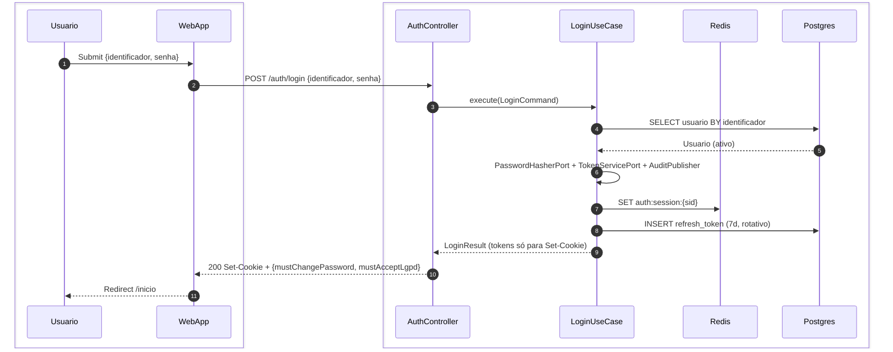
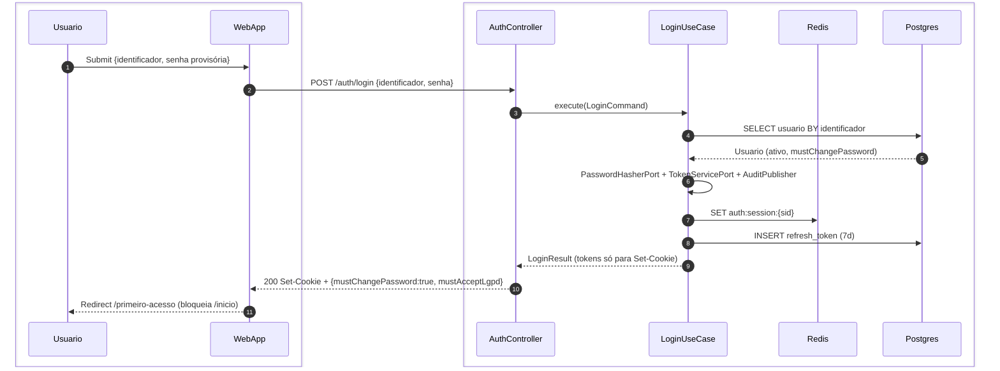
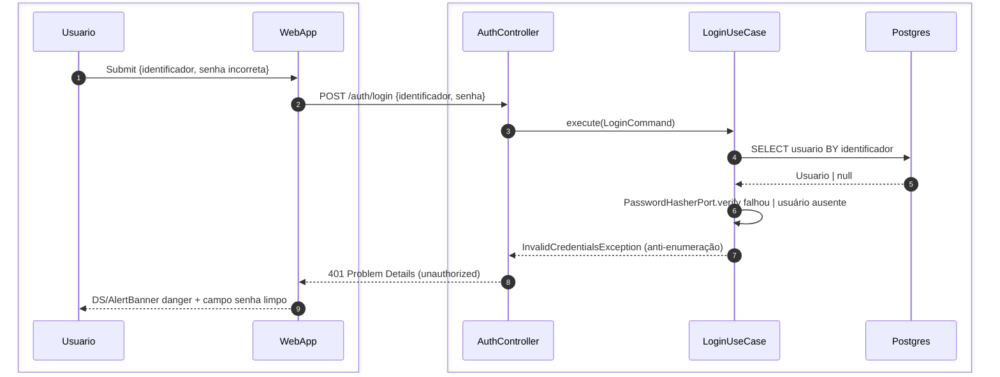
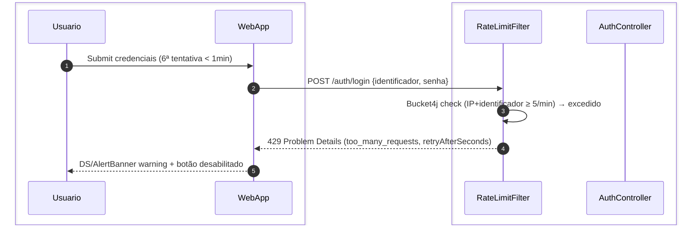
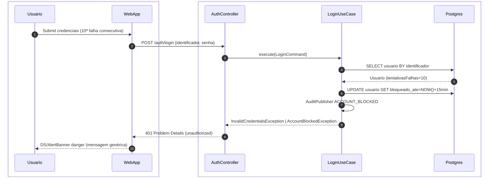
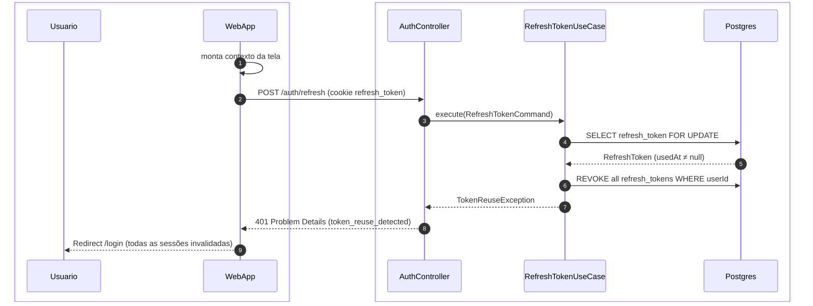

# US-F0-001 — Autenticação de Usuário (Login)

| HU | Tela | Capability | API primária | Fonte |
|----|------|------------|--------------|-------|
| US-F0-001 | F0.1 — `/login` | pública (sem JWT) | `POST /auth/login` · `POST /auth/refresh` · `POST /auth/ott` | `HUs/F0 — Público/US-F0-001-LOGIN.md` · `fluxos_por_perfil.md` §1 F0.1 · `as-built-backend.md` §2 |

---

## Matriz de cobertura

| ID diagrama | Origem (CA / RN / sub-fluxo) | Tipo | Status |
|-------------|------------------------------|------|--------|
| F0.1-a | CA-01 · RN-F0.1-01..05 · RN-F0.1-11 · F0.1 fluxo principal | SEQUENCIA | gerado |
| F0.1-b | CA-02 · RN-F0.1-04 | SEQUENCIA | gerado |
| F0.1-c | CA-03 · RN-F0.1-08 · RN-F0.1-11 | ERRO | gerado |
| F0.1-d | CA-04 · RN-F0.1-06 · RN-F0.1-09 | ERRO | gerado |
| F0.1-e | CA-05 · RN-F0.1-07 · RN-F0.1-11 | ERRO | gerado |
| F0.1-f | RN-F0.1-10 · sub-fluxo "Reuso de refresh token" (F0.1) | SEQUENCIA | gerado |
| F0.1-g | `POST /auth/ott` happy path (as-built 2026-08) | SEQUENCIA | gerado |
| F0.1-h | `POST /auth/ott` replay (JTI já consumido → 401) | ERRO | gerado |
| — | CA-06 (validação de campos vazios) | NAO_APLICAVEL | — |
| — | CA-07 (links de navegação estáticos) | NAO_APLICAVEL | — |
| — | Acessibilidade (tab order, aria-live, contraste) | NAO_APLICAVEL | Coberto por RNF-UX-01/02/03 — sem CA específico nesta HU; sem fluxo HTTP. |
| — | Responsividade mobile (layout 375px, safe area) | NAO_APLICAVEL | Coberto por RNF-UX-03 — requisito de layout CSS; sem troca de mensagens entre camadas. |
| — | RN-F0.1-12 (CSRF Double Submit Cookie — HTTP transport) | NAO_APLICAVEL | — |

---

## Referências DRY

Nenhuma. US-F0-001 não delega fluxo a outra HU.

Relacionado downstream: `/primeiro-acesso` após `mustChangePassword=true` é coberto em **US-F1-002**. Deep-link de e-mail (`?ott=`) → F0.1-g; dispatch do e-mail em `transversal/10.1-outbox-notificacao.md`.

---

## Fora de sequência

| Item | Motivo |
|------|--------|
| CA-06 — Validação de campos vazios | Lógica exclusivamente frontend (React Hook Form + Zod); nenhuma chamada HTTP é feita — não há troca de mensagens para diagramar. |
| CA-07 — Links "Esqueci minha senha", "Contato", "Verificar protocolo" | Navegação React Router client-side; sem interação com backend. |
| Acessibilidade (tab order, aria-live, contraste ≥ 4,5:1) | Atributo de qualidade transversal — coberto por RNF-UX-01, RNF-UX-02 e RNF-UX-03; não faz parte desta HU como CA específico. |
| Responsividade mobile (largura 375px, safe area) | Atributo de qualidade transversal — coberto por RNF-UX-03; sem troca de mensagens entre sistemas. |
| RN-F0.1-12 — CSRF Double Submit Cookie | Política de transporte HTTP; `POST /auth/login`, `/refresh` e `/ott` estão em CSRF ignore. |
| RateLimitFilter no happy path | Pass-through — documentado só em F0.1-d (429). O mesmo filtro cobre `POST /auth/ott`. |

---

## F0.1-a — Login happy path

**Escopo:** happy path  
**Atores:** Usuário (qualquer perfil), WebApp, AuthController, LoginUseCase, Redis, Postgres  
**Pré-condições:** conta ativa, `mustChangePassword()=false`, menos de 5 tentativas no último minuto



**Notas:**
- Cadeia HTTP: `RateLimitFilter` (pass-through) → `AuthController` → `LoginUseCase`. O 429 está em F0.1-d.
- Passo 1: `identificador` aceita e-mail `@ufpr.br`, e-mail pessoal ou GRR — normalizado (`trim` + lowercase) no UseCase.
- Passo 6: `PasswordHasherPort.verify` (Argon2id no adapter) — **não** é round-trip ao Postgres. `TokenServicePort.issueAccessToken` inclui claim `sid`. `AuditPublisher` emite `LOGIN_SUCCESS`.
- Passo 7: `TokenRevocationPort.createSession` → Redis `auth:session:{sid}` (TTL = access TTL + 60 s).
- Passo 10: tokens **somente** em cookies HttpOnly (`access_token` Path=/; `refresh_token` Path=/auth). JSON **nunca** contém `accessToken`/`refreshToken`.
- SPA usa os flags do body para redirect (`/primeiro-acesso` se `mustChangePassword`).

**Lacunas:** nenhuma.

---

## F0.1-b — Login → primeiro acesso (mustChangePassword)

**Escopo:** happy path — variação com senha provisória / LGPD pendente  
**Atores:** Usuário, WebApp, AuthController, LoginUseCase, Redis, Postgres  
**Pré-condições:** conta ativa, `mustChangePassword()=true` (primeiro acesso ou reset administrativo)



**Notas:**
- Mesmo contrato de F0.1-a: cookies HttpOnly; body só com flags. Sessão Redis é criada mesmo no primeiro acesso — o cookie `access_token` autentica `POST /auth/first-access`.
- WebApp bloqueia rotas protegidas enquanto `mustChangePassword=true` (RN-F0.1-04).
- Fluxo de `/primeiro-acesso` coberto em **US-F1-002**.

**Lacunas:** nenhuma.

---

## F0.1-c — Login 401 — credenciais inválidas (anti-enumeração)

**Escopo:** erro 401  
**Atores:** Usuário, WebApp, AuthController, LoginUseCase, Postgres  
**Pré-condições:** identificador inexistente **ou** senha incorreta (< 10 falhas consecutivas, < 5 tentativas/min)



**Notas:**
- Passo 6: senha errada e usuário não encontrado produzem a mesma `InvalidCredentialsException`. `AuditPublisher` emite `LOGIN_FAILED` (não há `INSERT audit_log` direto no UseCase).
- `PasswordHasherPort` não é persistência — Argon2id vive no adapter.
- Passo 8: RFC 7807 `type: .../errors/unauthorized`. Campo `identificador` mantido; `senha` limpa no WebApp.

**Lacunas:** nenhuma.

---

## F0.1-d — Login 429 — rate limit atingido

**Escopo:** erro 429  
**Atores:** Usuário, WebApp, RateLimitFilter, AuthController  
**Pré-condições:** mesmo IP + identificador realizou ≥ 5 tentativas em < 1 minuto



**Notas:**
- `RateLimitFilter` é `OncePerRequestFilter` **antes** do `AuthController`; `LoginUseCase` não é invocado (RN-F0.1-06).
- O mesmo bucket cobre `POST /auth/ott` (`isOtt` no filtro) — 429 idêntico se o cliente martelar o exchange.
- Corpo RFC 7807 inclui `retryAfterSeconds` (RN-F0.1-09).

**Lacunas:** nenhuma.

---

## F0.1-e — Login 401 — conta bloqueada

**Escopo:** erro 401 — bloqueio temporário por tentativas excessivas  
**Atores:** Usuário, WebApp, AuthController, LoginUseCase, Postgres  
**Pré-condições:** identificador acumulou 10 falhas consecutivas de autenticação



**Notas:**
- Resposta HTTP permanece 401 genérico (anti-enumeração). `AuditPublisher` emite `ACCOUNT_BLOCKED` — não `INSERT audit_log` no UseCase.
- `bloqueado_ate` é verificado no início do fluxo nas tentativas seguintes (desbloqueio automático após 15 min).
- Este fluxo pressupõe que o rate limit (5/min) **não** bloqueou antes — os 10 erros acumularam em múltiplas janelas.

**Lacunas:** nenhuma.

---

## F0.1-f — Refresh token — reuso detectado (revogação de sessões)

**Escopo:** erro 401 — defesa contra roubo de token  
**Atores:** WebApp, AuthController, RefreshTokenUseCase, Postgres  
**Pré-condições:** cookie `refresh_token` já rotacionado (expirado por rotação)



**Notas:**
- Refresh **não** aceita token no JSON — lê cookie HttpOnly `refresh_token` (Path=/auth). Happy path: 200 com body vazio (ou `RefreshResponse.mensagem`) + novos Set-Cookie; tokens nunca no JSON.
- Passo 4: `SELECT FOR UPDATE` evita race em apresentação simultânea (RN-F0.1-10).
- Revogação de **todas** as sessões do usuário — defesa contra roubo de cookie.

**Lacunas:** nenhuma.

---

## F0.1-g — POST /auth/ott — exchange happy path

**Escopo:** cliente troca JWT one-time do e-mail (`?ott=`) por sessão (cookies)  
**Atores:** Usuário, WebApp, AuthController, ExchangeOttUseCase, Redis, Postgres  
**Pré-condições:** e-mail com `?ott=<jwt>`; audience `request:{uuid}`; JTI ainda não consumido; `permitAll` + CSRF ignore

```mermaid
sequenceDiagram
    autonumber
    box #e8f4fc Cliente
        participant Usuario
        participant WebApp
    end
    box #fff8ee Servidor
        participant AC as AuthController
        participant UC as ExchangeOttUseCase
        participant Redis
        participant DB as Postgres
    end

    Usuario->>WebApp: abre /solicitacoes/:id?ott=JWT
    WebApp->>AC: POST /auth/ott {token}
    AC->>UC: execute(ExchangeOttCommand)
    UC->>UC: TokenServicePort.parse audience request:{uuid}
    UC->>DB: SELECT usuario BY subject
    DB-->>UC: Usuario (ativo)
    UC->>Redis: consume JTI + SET auth:session:{sid}
    UC->>DB: INSERT refresh_token (7d)
    UC-->>AC: LoginResult (tokens só para Set-Cookie)
    AC-->>WebApp: 200 Set-Cookie + {mustChangePassword, mustAcceptLgpd}
    WebApp-->>Usuario: sessão ativa; segue o deep-link
```

**Notas:**
- Mesmo contrato do login: cookies HttpOnly; JSON só flags. `RateLimitFilter` aplica o mesmo bucket 5/min (F0.1-d).
- Audience deve começar com `request:`. JTI é consumido via `TokenRevocationPort.revokeAccessToken` (Redis) — replay em F0.1-h.
- `AuditPublisher` emite `OTT_EXCHANGED`. Template de e-mail: `transversal/10.1-outbox-notificacao.md`.

**Lacunas:** nenhuma.

---

## F0.1-h — POST /auth/ott — replay 401 (JTI já usado)

**Escopo:** erro 401 — segundo POST com o mesmo OTT  
**Atores:** WebApp, AuthController, ExchangeOttUseCase, Redis  
**Pré-condições:** JTI do token já revogado no Redis

```mermaid
sequenceDiagram
    autonumber
    box #e8f4fc Cliente
        participant Usuario
        participant WebApp
    end
    box #fff8ee Servidor
        participant AC as AuthController
        participant UC as ExchangeOttUseCase
        participant Redis
    end

    WebApp->>WebApp: replay POST com o mesmo ?ott=
    WebApp->>AC: POST /auth/ott {token}
    AC->>UC: execute(ExchangeOttCommand)
    UC->>Redis: isRevoked(jti) → true
    UC-->>AC: InvalidTokenException
    AC-->>WebApp: 401 Problem Details (unauthorized)
    WebApp-->>Usuario: DS/AlertBanner — solicite um novo link
```



**Notas:**
- Mensagem de domínio: "Token já utilizado. Solicite um novo link." HTTP 401 (não 409).
- Token inválido, expirado ou audience ≠ `request:*` também 401 — sem enumerar o motivo ao cliente além do Problem Details.

**Lacunas:** nenhuma.
