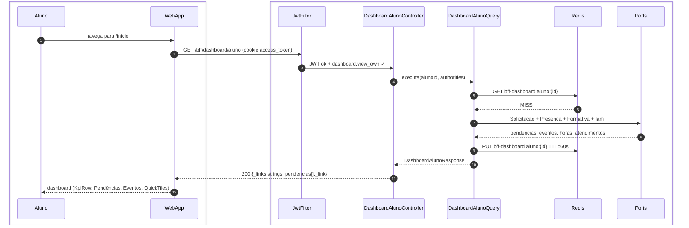
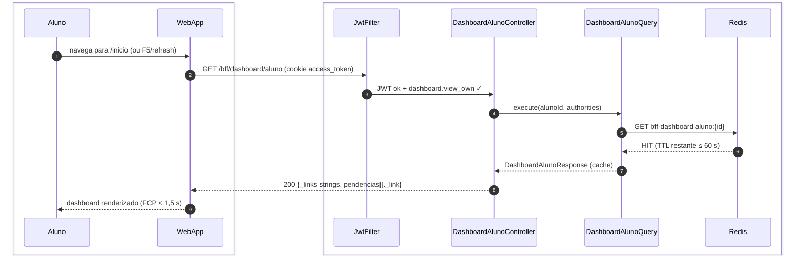
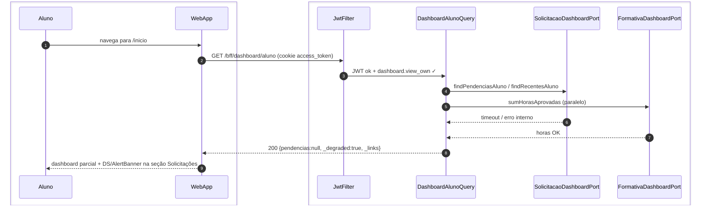
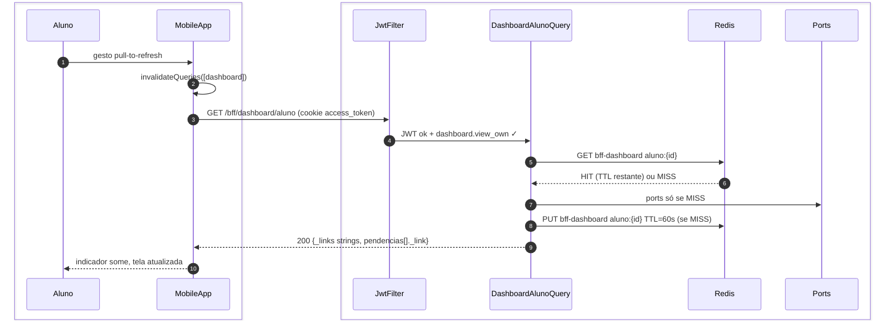

# US-F1-001 — Dashboard do Aluno (Visão Unificada)

| HU | Tela | Capability | API primária | Fonte |
|----|------|------------|--------------|-------|
| US-F1-001 | F1.1 — `/inicio` | `dashboard.view_own` | `GET /bff/dashboard/aluno` | `HUs/F1 — Aluno/US-F1-001-DASHBOARD.md` · `fluxos_por_perfil.md` §2 F1 · `as-built-backend.md` §3 |

---

## Matriz de cobertura

| ID diagrama | Origem (CA / RN / sub-fluxo) | Tipo | Status |
|-------------|------------------------------|------|--------|
| F1.1-D01 | CA-01 · RN-F1.1-01 · RN-F1.1-10 (cache MISS) — carregamento inicial | SEQUENCIA | gerado |
| F1.1-D02 | RN-F1.1-10 (cache HIT) — retorno em < 1,5 s | SEQUENCIA | gerado |
| F1.1-D03 | CA-05 · RN-F1.1-01 — degradação graciosa (módulo indisponível) | SEQUENCIA | gerado |
| F1.1-D04 | CA-07 · RN-F1.1-11 — pull-to-refresh mobile | SEQUENCIA | gerado |
| — | CA-02 (KpiCard horas formativas) | DRY | → F1.1-D01 (resposta BFF inclui `kpis.horasFormativas`) |
| — | CA-03 (pendências com CTA) | DRY | → F1.1-D01 (`pendencias[]._link` string) |
| — | RN-F1.1-02 (cálculo `horas_validadas / horas_requeridas`) | DRY | → F1.1-D01 (calculado no Query antes de retornar) |
| — | RN-F1.1-03 (máx. 3 pendências, `_link` CTA) | DRY | → F1.1-D01 |
| — | RN-F1.1-05 (3 próximos eventos, badge "Janela aberta") | DRY | → F1.1-D01 |
| — | RN-F1.1-06 (último parecer) | DRY | → F1.1-D01 |
| — | RN-F1.1-07 (`_links.novaSolicitacao`) | DRY | → F1.1-D01 |
| — | RN-F1.1-08 (`_links.hub` unreadCount) | DRY | → F1.1-D01 |
| — | RN-F1.1-09 (QuickTiles de `_links`) | DRY | → F1.1-D01 |
| — | CA-04 (SLA breach — célula em `status/danger`) | NAO_APLICAVEL | — |
| — | CA-06 (estado vazio — DS/EmptyState por seção) | NAO_APLICAVEL | — |
| — | CA-08 (responsividade — 375/768/1280px) | NAO_APLICAVEL | — |
| — | RN-F1.1-04 (badge SLA vermelho) | NAO_APLICAVEL | — |

---

## Referências DRY

| Padrão | Arquivo canônico |
|--------|-----------------|
| JWT validation + `dashboard.view_own` FGAC | `F0/US-F0-001-LOGIN.md` F0.1-a (cookie `access_token`; Bearer fallback) |
| Outbox dispatcher (notificação de certificado/formativa) | `transversal/10.1-outbox-notificacao.md` |
| Emissão de certificado (trigger background) | `transversal/10.4-certificado-emissao.md` |

---

## Fora de sequência

| Item | Motivo |
|------|--------|
| CA-04 — SLA breach (célula vermelha) | Lógica exclusivamente frontend: `prazo_em < Date.now()` comparado no cliente após receber a resposta; nenhuma chamada HTTP adicional. |
| CA-06 — Estado vazio (DS/EmptyState) | Mesmo fluxo de CA-01; diferença é só o conteúdo do JSON retornado (arrays vazios). Sem variação de participantes ou mensagens. |
| CA-08 — Responsividade (375/768/1280px) | Requisito de layout CSS/NativeWind; sem troca de mensagens entre camadas. |
| RN-F1.1-04 — Badge SLA | Computação client-side derivada de `prazo_em` já presente na resposta do BFF. |

---

## F1.1-D01 — Carregamento inicial do dashboard (happy path — cache MISS)

**Escopo:** happy path — primeiro acesso ou cache Redis expirado  
**Atores:** Aluno, WebApp, JwtFilter, DashboardAlunoController, DashboardAlunoQuery, Redis  
**Pré-condições:** aluno autenticado (`mustChangePassword = false`), cookie `access_token` válido com `dashboard.view_own`

**Notas:**
- Auth: cookie HttpOnly `access_token` (Bearer é fallback do `JwtAuthenticationFilter`).
- Ports (nunca JPA no BFF): `SolicitacaoDashboardPort`, `PresencaDashboardPort`, `FormativaDashboardPort`, `IamDashboardPort`. Adapters JPA ficam nos módulos donos.
- Cache name `bff-dashboard`, chave `aluno:{id}`, TTL **60 s** (`CacheConfig`). Sem Redis → cache `simple` Spring.
- `_links` é objeto de **strings** (`self`, `novaSolicitacao`, `formativas`, `eventos`) — não HAL `{href}`. Itens de pendência usam `_link` (singular, string).
- `novaSolicitacao` só é preenchido se `request.open` estiver nas authorities.

**Lacunas:** nenhuma.

---

## F1.1-D02 — Carregamento do dashboard (cache HIT — FCP < 1,5 s)

**Escopo:** retorno em cache Redis dentro da janela de 60 s (RN-F1.1-10)  
**Atores:** Aluno, WebApp, JwtFilter, DashboardAlunoController, DashboardAlunoQuery, Redis  
**Pré-condições:** cache `bff-dashboard` populado há menos de 60 s para `aluno:{id}`

**Notas:**
- HIT não chama ports. Pull-to-refresh (F1.1-D04) invalida só TanStack Query no cliente — Redis segue o TTL de 60 s.
- Resposta degradada (`_degraded=true`) **não** é gravada no cache (MISS sempre reconsulta ports).

**Lacunas:** nenhuma.

---

## F1.1-D03 — Degradação graciosa (módulo de solicitações indisponível)

**Escopo:** erro parcial de módulo — CA-05, RN-F1.1-01  
**Atores:** Aluno, WebApp, JwtFilter, DashboardAlunoQuery, SolicitacaoDashboardPort, FormativaDashboardPort  
**Pré-condições:** `SolicitacaoDashboardPort` lança timeout; demais ports respondem

**Notas:**
- Controller omitido para caber ports: `DashboardAlunoController` só delega a `DashboardAlunoQuery.execute`.
- HTTP continua **200**; `pendencias`/`ultimasSolicitacoes` null + `_degraded=true`. Não há PUT no Redis quando degradado.
- `try/catch` por port — falha de um bloco não cancela os demais.

**Lacunas:** nenhuma.

---

## F1.1-D04 — Pull-to-refresh no mobile (CA-07, RN-F1.1-11)

**Escopo:** pull-to-refresh reinvalida cache TanStack Query e rebusca dados  
**Atores:** Aluno, MobileApp, DashboardAlunoQuery, Redis  
**Pré-condições:** aluno autenticado no app mobile, dashboard já carregado

**Notas:**
- Pull-to-refresh **não** apaga Redis. HIT devolve o agregado de até 60 s. Bearer só se o mobile não enviar cookie.
- `DashboardAlunoController` omitido (delega 1:1 ao Query).

**Lacunas:** nenhuma.
