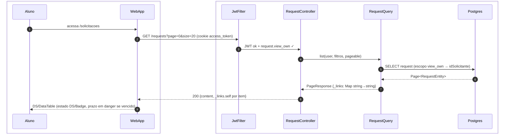
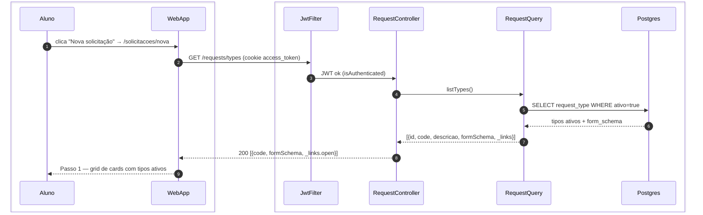
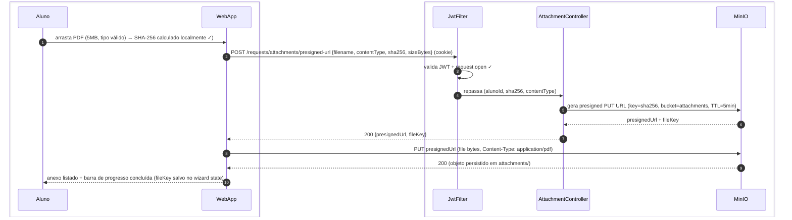
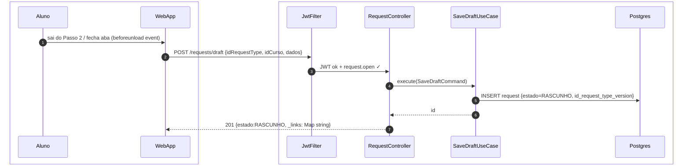
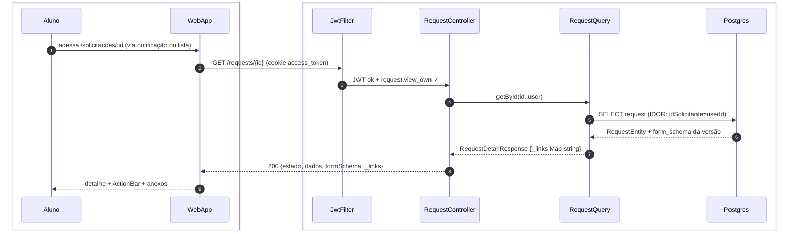
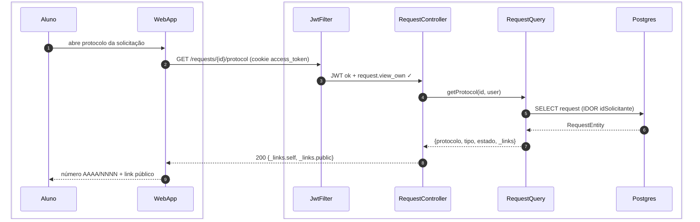
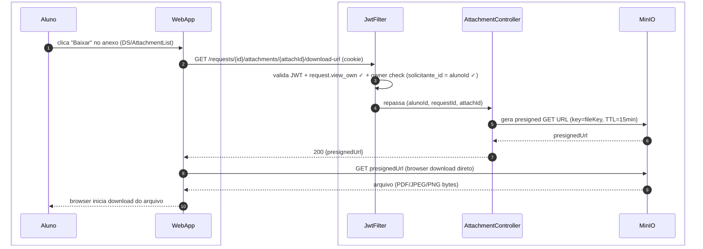

# US-F1-005 — Abrir, Listar e Acompanhar Solicitações

| HU | Telas | Capability | API primária | Fonte |
|----|-------|------------|--------------|-------|
| US-F1-005 | F1.7 `/solicitacoes` · F1.8 `/solicitacoes/nova` · F1.9 `/solicitacoes/:id` | `request.view_own` · `request.open` | `GET /requests` · `GET /requests/types` · `POST /requests` · `POST /requests/draft` · `GET /requests/{id}` · `GET /requests/{id}/protocol` | `HUs/F1 — Aluno/US-F1-005-SOLICITACOES.md` · `fluxos_por_perfil.md` §2 F1.2, F1.3 · `as-built-backend.md` §4 |

---

## Matriz de cobertura

| ID diagrama | Origem (CA / RN / sub-fluxo) | Tipo | Status |
|-------------|------------------------------|------|--------|
| F1.7-D01 | CA-01 · RN-F1.7-01 — listar solicitações paginadas com filtros | SEQUENCIA | gerado |
| F1.8-D02 | CA-02 · RN-F1.8-02 — Passo 1: GET /requests/types (ativo=true) | SEQUENCIA | gerado |
| F1.8-D03 | CA-04 · RN-F1.8-04 — upload de anexo (SHA-256 + MinIO presigned PUT) | SEQUENCIA | gerado |
| F1.8-D04 | CA-05 · RN-F1.8-06 · RN-F1.8-07 — POST /requests (confirmar + workflow + outbox) | SEQUENCIA | gerado |
| F1.8-D05 | CA-06 · RN-F1.8-05 — POST /requests/draft (salvar rascunho no backend) | SEQUENCIA | gerado |
| F1.9-D06 | CA-07 · RN-F1.9-01 · RN-F1.9-04 — GET /requests/{id} (detalhe + timeline + _links) | SEQUENCIA | gerado |
| F1.9-D07 | RN-F1.9-03 — GET /requests/{id}/protocol (RequestQuery) | SEQUENCIA | gerado |
| F1.9-D08 | RN-F1.9-05 — GET presigned download URL de anexo (MinIO, TTL=15 min) | SEQUENCIA | gerado |
| — | CA-03 / RN-F1.8-03 (renderização do form_schema + validação Zod — client-side) | NAO_APLICAVEL | — |
| — | RN-F1.7-02 (SLA danger — visual client-side) | NAO_APLICAVEL | — |
| — | RN-F1.7-03 (mobile cards + sheet/drawer — layout CSS) | NAO_APLICAVEL | — |
| — | RN-F1.8-01 (navegação dos 3 passos do wizard — client-side routing) | NAO_APLICAVEL | — |
| — | RN-F1.9-02 (editar → reabre wizard — client-side navigation) | NAO_APLICAVEL | — |
| — | RN-F1.7-01 (paginação + filtros backend) | DRY | → F1.7-D01 |
| — | RN-F1.8-02 (filtro de elegibilidade no backend) | DRY | → F1.8-D02 |
| — | RN-F1.8-04 (SHA-256 + MinIO presigned) | DRY | → F1.8-D03 |
| — | RN-F1.8-05 (rascunho local + backend) | DRY | → F1.8-D05 |
| — | RN-F1.8-06 (workflow inicial + prazo_em + numero_anual + outbox) | DRY | → F1.8-D04 |
| — | RN-F1.8-07 (notificação in-app + push após criação) | DRY | → `transversal/10.1-outbox-notificacao.md` |
| — | RN-F1.9-01 (_links exclusivos na ActionBar) | DRY | → F1.9-D06 |
| — | RN-F1.9-04 (timeline ordem reversa) | DRY | → F1.9-D06 |

---

## Referências DRY

| Padrão | Arquivo canônico |
|--------|-----------------|
| JWT validation + capability check (JwtFilter) | `F0/US-F0-001-LOGIN.md` F0.1-a (cookie `access_token`; Bearer fallback) |
| MinIO presigned URL upload (P5 — PUT) | `F1/US-F1-003-PERFIL.md` F1.3-D02 |
| Outbox dispatcher (notificação solicitacoes.opened) | `transversal/10.1-outbox-notificacao.md` |

---

## Fora de sequência

| Item | Motivo |
|------|--------|
| CA-03 / RN-F1.8-03 — Passo 2 renderiza form_schema com Zod | O `form_schema` já vem no payload do GET /request-types (D02). A renderização do `DS/DynamicForm` e a validação Zod são exclusivamente client-side; nenhuma chamada HTTP adicional durante a digitação. |
| RN-F1.7-02 — SLA danger (prazo em vermelho) | Computação client-side: `prazoEm < Date.now()` após receber a resposta do GET. Igual ao CA-04 de US-F1-001. |
| RN-F1.7-03 — Mobile: cards + sheet/drawer | Requisito de layout responsivo (CSS/NativeWind); sem variação de mensagens HTTP. |
| RN-F1.8-01 — Navegação entre os 3 passos do wizard | Estado do wizard gerenciado pelo cliente (React state machine / `DS/WizardStepper`); sem chamada HTTP entre passos. |
| RN-F1.9-02 — Editar reabre wizard Passo 2 | Client-side navigation: `_links.editar.href` → React Router push para `/solicitacoes/nova?edit=:id`; nenhuma chamada HTTP no redirect. |

---

## F1.7-D01 — Listar solicitações paginadas (GET /requests?solicitante=me)

**Escopo:** happy path — aluno acessa `/solicitacoes` e vê suas solicitações com filtros opcionais  
**Atores:** Aluno, WebApp, JwtFilter, RequestController, RequestQuery, Postgres  
**Pré-condições:** aluno autenticado com `request.view_own`



**Notas:**
- GET **não** usa `?solicitante=me`. `RequestQuery.list` infere `idSolicitante=userId` quando o token só tem `request.view_own`.
- `_links` é `Map<String,String>` (ex. `self` → `/requests/{id}`), não HAL `{href}`.
- Filtros reais: `estado`, `idCurso`, `typeCode`/`type` + `Pageable`. Wizard de tipos: `GET /requests/types` (D02).
- Auth: cookie `access_token` (Bearer fallback).

**Lacunas:** nenhuma.

---

## F1.8-D02 — Passo 1 do wizard: tipos de solicitação elegíveis (GET /request-types)

**Escopo:** Passo 1 — backend filtra tipos pelo curso, período e pré-requisitos do aluno  
**Atores:** Aluno, WebApp, JwtFilter, RequestController, RequestQuery, Postgres  
**Pré-condições:** aluno autenticado; navega para `/solicitacoes/nova`



**Notas:**
- Catálogo do wizard é `GET /requests/types` (`RequestQuery.listTypes`) — **não** `GET /request-types` (esse path é admin: `AdminRequestTypeController`).
- Só tipos `ativo=true`. `_links` strings: `self`, `open`, `save-draft`.
- `GET /requests/types/{code}` carrega detalhe + `workflowJson` se o wizard precisar.

**Lacunas:** nenhuma.

---

## F1.8-D03 — Upload de anexo no wizard (SHA-256 + MinIO presigned PUT)

**Escopo:** CA-04 · RN-F1.8-04 — aluno envia arquivo PDF ao MinIO diretamente via URL pré-assinada  
**Atores:** Aluno, WebApp, JwtFilter, AttachmentController, MinIO  
**Pré-condições:** aluno no Passo 2 do wizard; arquivo ≤ 10 MB, tipo PDF/JPEG/PNG



**Notas:**
- Passo 1: o SHA-256 é calculado no browser via `crypto.subtle.digest('SHA-256', buffer)` antes de qualquer upload — sem chamada HTTP. O backend recebe o hash para validar integridade pós-upload (comparação opcional via `MinIO.statObject`).
- O `storageKey` fica no wizard e vai em `attachments[]` do POST /requests (D04).
- Se o arquivo exceder 10 MB, a rejeição ocorre no passo 1 (File API no cliente) — sem chamada HTTP.

**Lacunas:** nenhuma.

---

## F1.8-D04 — Confirmar wizard: POST /requests (criar solicitação + workflow + outbox)

**Escopo:** CA-05 · RN-F1.8-06 · RN-F1.8-07 — Passo 3 confirmado; backend abre solicitação, calcula prazo, emite evento  
**Atores:** Aluno, WebApp, JwtFilter, RequestController, OpenRequestUseCase, Postgres, OutboxEventPublisher  
**Pré-condições:** Passos 1 e 2 completos; form_schema validado; anexos enviados ao MinIO

```mermaid
sequenceDiagram
    autonumber
    box #e8f4fc Cliente
        participant Aluno
        participant WebApp
    end
    box #fff8ee Servidor
        participant JwtFilter
        participant RC as RequestController
        participant UC as OpenRequestUseCase
        participant Postgres
        participant Outbox as OutboxEventPublisher
    end

    Aluno->>WebApp: clica "Confirmar" no Passo 3 (revisão ok)
    WebApp->>JwtFilter: POST /requests {idRequestType, idCurso, dados, attachments}
    JwtFilter->>RC: JWT ok + request.open ✓
    RC->>UC: execute(OpenRequestCommand)
    UC->>Postgres: BEGIN; SELECT request_type (ativo, form_schema, workflow)
    UC->>Postgres: INSERT request (estado=initial, id_request_type_version)
    UC->>Outbox: enqueue(solicitacoes.aberta, Request, id)
    UC-->>RC: id
    RC-->>WebApp: 201 {_links.self: /requests/{id}}
    WebApp-->>Aluno: redireciona /solicitacoes/:id + DS/Toast
```

**Notas:**
- Body as-built: `idRequestType`, `idCurso`, `dados`, `attachments[]` — não `requestTypeCode`/`attachmentKeys`.
- V019: `OpenRequestUseCase` grava `id_request_type_version = versionStore.latestId(typeId)` no INSERT.
- Outbox via `OutboxEventPublisher.enqueue` na mesma `@Transactional` — o UseCase **não** injeta `OutboxEventJpaRepository`.
- `_links` no 201: `Map` string→string (`self`). Dispatch → `transversal/10.1-outbox-notificacao.md`.

**Lacunas:** nenhuma.

---

## F1.8-D05 — Salvar rascunho no backend (POST /requests/draft)

**Escopo:** CA-06 · RN-F1.8-05 — aluno sai do wizard; dados parciais são persistidos no backend como `RASCUNHO`  
**Atores:** Aluno, WebApp, JwtFilter, RequestController, SaveDraftUseCase, Postgres  
**Pré-condições:** aluno está no Passo 2 com dados parciais; fecha aba ou navega para outra rota



**Notas:**
- O rascunho também é salvo localmente via PWA/AsyncStorage (conforme RN-F1.8-05) para recuperação offline; o backend é a fonte da verdade persistente.
- Ao retornar para `/solicitacoes/nova`, o frontend verifica localStorage/AsyncStorage: se encontrar `draftId`, exibe modal "Continuar rascunho ou começar novo?" — decisão exclusivamente client-side, sem nova chamada HTTP.
- `_links` do rascunho: `self`, `submit`, `update-draft`, `upload-url` (strings). `SaveDraftUseCase` também carimba `id_request_type_version` (V019).
- O rascunho aparece em `/solicitacoes` (F1.7-D01) com badge "Rascunho" — `estado=RASCUNHO` no GET /requests.

**Lacunas:** nenhuma.

---

## F1.9-D06 — Detalhe da solicitação com timeline e _links HATEOAS

**Escopo:** CA-07 · RN-F1.9-01 · RN-F1.9-04 — GET /requests/{id} retorna dados completos, timeline reversa e ações disponíveis  
**Atores:** Aluno, WebApp, JwtFilter, RequestController, RequestQuery, Postgres  
**Pré-condições:** aluno autenticado com `request.view_own`; solicitação existe e pertence ao aluno



**Notas:**
- `_links` é `Map<String,String>` (`self`, `events`, `attachments`, `submit`, `update-draft`, `upload-url`, ações kebab-case) — **não** `{ href }`.
- GET detalhe usa `form_schema` da `request_type_version` da instância (V019: `idRequestTypeVersion`).
- Timeline: `GET /requests/{id}/events` via `RequestQuery.events` (não vem no mesmo GET).
- ActionBar 100% derivada das chaves de `_links`.

**Lacunas:** nenhuma.

---

## F1.9-D07 — Protocolo da solicitação (GET /requests/{id}/protocol)

**Escopo:** RN-F1.9-03 — aluno lê número de protocolo e link público  
**Atores:** Aluno, WebApp, JwtFilter, RequestController, RequestQuery, Postgres  
**Pré-condições:** aluno autenticado com `request.view_own`; solicitação existe



**Notas:**
- As-built é **GET** via `RequestQuery.getProtocol` — não há `POST /requests/{id}/protocol` nem geração síncrona de PDF/MinIO neste endpoint.
- `_links.public` → `/publico/solicitacoes/{ano}/{numeroAnual}` (US-F0-006).
- Verificação pública permanece em `F0/US-F0-006-VERIFICAR-PROTOCOLO.md`.

**Lacunas:** nenhuma.

---

## F1.9-D08 — Download de anexo via presigned GET URL (MinIO, TTL=15 min)

**Escopo:** RN-F1.9-05 — aluno baixa um anexo da solicitação sem trafegar bytes pelo backend  
**Atores:** Aluno, WebApp, JwtFilter, AttachmentController, MinIO  
**Pré-condições:** solicitação carregada (D06); anexo presente na `DS/AttachmentList`



**Notas:**
- TTL=15 min (RN-F1.9-05): curto o suficiente para dificultar compartilhamento indevido, longo o suficiente para o browser iniciar o download sem erro de expiração.
- Diferença vs D03 (upload): aqui é presigned **GET** (download) com TTL=15 min vs presigned **PUT** (upload) com TTL=5 min. O `fileKey` vem do `attachment.file_key` retornado em D06.
- O owner check do passo 3 garante que um aluno não possa gerar URL de download para anexo de solicitação alheia — proteção IDOR por `requestId` + `attachId`.

**Lacunas:** nenhuma.
