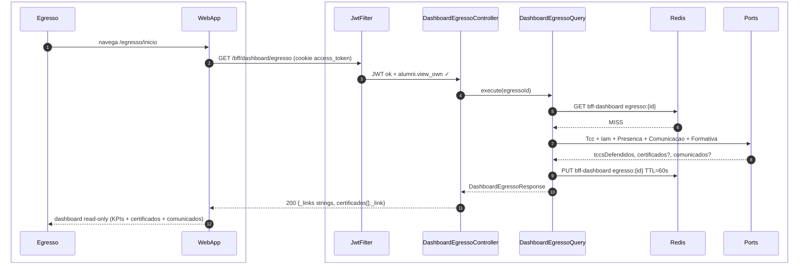
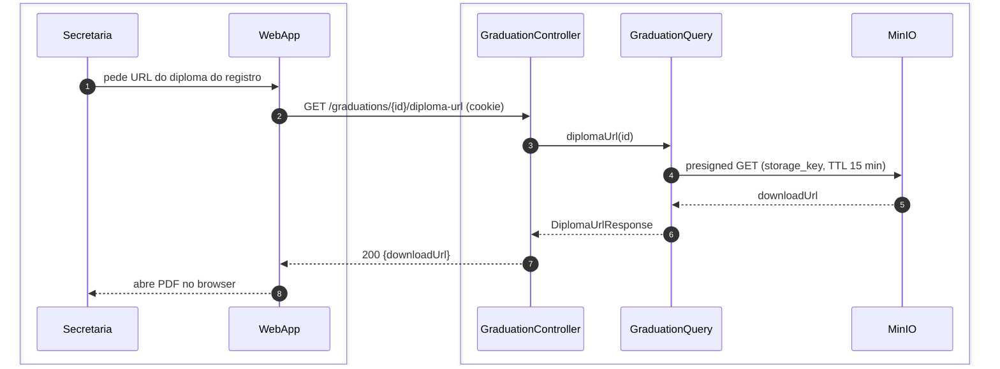
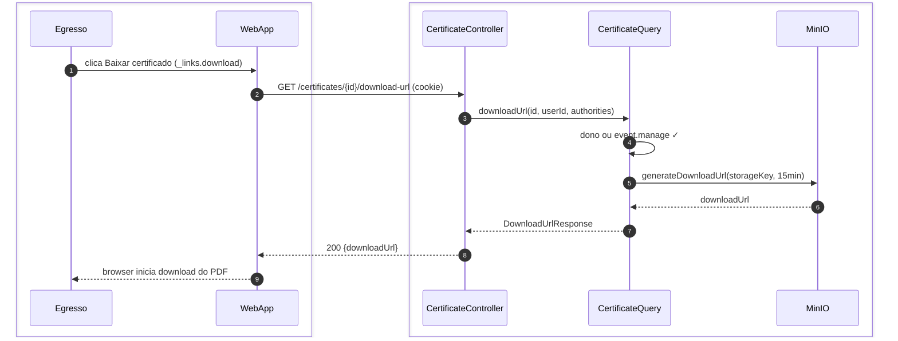
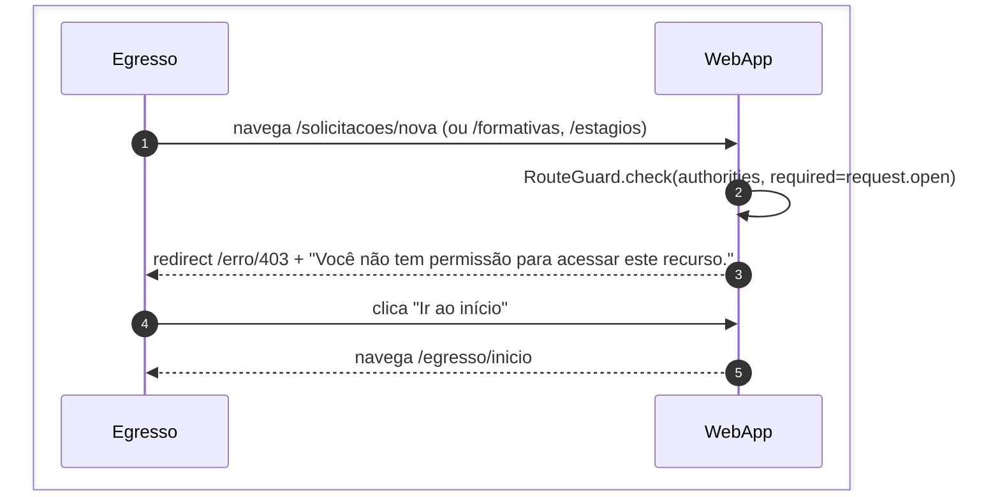

# US-F2-001 — Dashboard do Egresso e Reemissão de Certificados

| HU | Tela | Capability | API primária | Fonte |
|----|------|------------|-------------|-------|
| US-F2-001 | F2.1 — `/egresso/inicio` | `alumni.view_own` | `GET /bff/dashboard/egresso` | `fluxos_por_perfil.md` §3 F2.1 · `as-built-backend.md` §3 |

---

## Matriz de cobertura

| ID diagrama | Origem (CA/RN) | Tipo | Status |
|-------------|----------------|------|--------|
| F2.1-D01 | CA-02 — `GET /bff/dashboard/egresso` (Query + ports + cache 60 s) | SEQUENCIA | gerado |
| F2.1-D02 | RN-F2.1-10 — diploma institucional `GET /graduations/{id}/diploma-url` (secretaria/admin) | SEQUENCIA | gerado |
| F2.1-D03 | CA-03 — certificado `GET /certificates/{id}/download-url` (mesmo artefato) | SEQUENCIA | gerado |
| F2.1-D04 | CA-04 — 403 egresso tenta rota exclusiva de aluno | ERRO | gerado |
| — | CA-05 — navegar para /perfil e /certificados | DRY | → US-F1-003, US-F1-010 |
| — | Trigger transição ALUNO→EGRESSO | DRY | → US-F5-005 (tela F5.11) |
| — | CA-06 — Loading (Skeleton) / EmptyState | NAO_APLICAVEL | ver §Fora de sequência |
| — | CA-07 — Acessibilidade WCAG 2.1 AA | NAO_APLICAVEL | ver §Fora de sequência |

---

## Referências DRY

- **CA-05 — Perfil:** `PATCH /users/me` + upload de foto (presigned MinIO) →
  [`F1/US-F1-003-PERFIL.md`](../F1/US-F1-003-PERFIL.md) (F1.3-D01, F1.3-D02).
  O egresso mantém `user.update_own_profile`; os fluxos são idênticos.

- **CA-05 — Certificados:** listagem + download presigned →
  [`F1/US-F1-010-CERTIFICADOS.md`](../F1/US-F1-010-CERTIFICADOS.md) (F1.19-D01, F1.19-D02).
  Mesmos endpoints; capability `alumni.view_own` é a que autentica ambos os perfis.

- **Trigger egresso (transição ALUNO→EGRESSO):** registrar colação/diploma,
  revogar capabilities de aluno, conceder `alumni.view_own`, `outbox_event` `egressos.graduated` →
  coberto em **US-F5-005** (tela F5.11). Este arquivo documenta somente o comportamento
  **após** a transição.

- **Dispatch `egressos.graduated`:** fluxo assíncrono de notificação →
  [`transversal/10.1-outbox-notificacao.md`](../transversal/10.1-outbox-notificacao.md) §10.1b.

---

## Fora de sequência

| CA/RN | Motivo |
|-------|--------|
| CA-06 — Skeleton (loading) | Estado TanStack Query `isFetching`; o backend executa o mesmo `GET /bff/dashboard/egresso` — sem fluxo distinto. |
| CA-06 — EmptyState (sem certificados) | Condicional de apresentação: `certificados[]` vazio retornado na resposta F2.1-D01 — sem nova chamada. |
| CA-07 — aria-readonly, H1/H2, aria-label em botões | Atributos HTML estáticos; nenhuma chamada backend específica. |
| RN-F2.1-02 — redirect `/erro/403` (client-side) | Parte do fluxo F2.1-D04 (RouteGuard); sem sequência backend adicional. |
| RN-F2.1-03 — rotas mantidas (/perfil, /certificados) | Reaproveitamento direto (DRY) → US-F1-003 e US-F1-010. |

---

## F2.1-D01 — GET /bff/dashboard/egresso (happy path — cache MISS)

**Escopo:** Egresso autenticado acessa `/egresso/inicio`; BFF agrega via ports (sem JPA no módulo BFF).  
**Atores:** Egresso, WebApp, JwtFilter, DashboardEgressoController, DashboardEgressoQuery, Redis  
**Pré-condições:** cookie `access_token` com `alumni.view_own`

**Notas:**
- **Não existe** `GET /alumni/me` nem `AlumniController` as-built. Dashboard = `DashboardEgressoQuery` + ports.
- Cache name `bff-dashboard`, chave `egresso:{id}`, TTL **60 s**.
- `_links` strings (`self`, `certificados`, `comunicados`). Itens de certificado usam `_link`.
- Auth: cookie `access_token` (Bearer fallback).

**Lacunas:** campos `nomeAluno`/`emailAluno`/`certificados`/`comunicados` podem vir null se o port ainda não popular — `_degraded` quando um port falha.

---

## F2.1-D02 — Diploma institucional (secretaria/admin)

**Escopo:** staff gera URL pré-assinada do PDF de diploma — **não** é path de egresso (`alumni.view_own`).
**Atores:** Secretaria, WebApp, GraduationController, GraduationQuery, MinIO
**Pré-condições:** cookie com `diploma.register` ou `alumni.list` ou `system.admin`; registro de colação existe (US-F5-005)

**Notas:**
- `@PreAuthorize` as-built: `diploma.register` **ou** `alumni.list` **ou** `system.admin`. **Não** há mapping `alumni.view_own` neste path.
- Egresso baixa certificado de participação em F2.1-D03 (`GET /certificates/{id}/download-url`), não o diploma institucional.
- Não existe `GET /alumni/me` nem `AlumniController`.

**Lacunas:** nenhuma.

---

## F2.1-D03 — Download de certificado (mesmo artefato, sem reemitir)

**Escopo:** egresso (dono) ou `event.manage` obtém presigned GET do PDF já emitido — sem novo hash/assinatura.
**Atores:** Egresso, WebApp, CertificateController, CertificateQuery, MinIO
**Pré-condições:** certificado emitido; `_links.download` de `GET /certificates/mine` ou `_link` do dashboard

**Notas:**
- As-built: só `GET /certificates/mine` e `GET /certificates/{id}/download-url`. **Não** há `POST .../reissue`.
- IDOR: `idAluno == userId` ou `event.manage`. Hash/assinatura originais (CA-03).
- Verificação pública: `/publico/verificar-certificado/{hash}` — [`F0/US-F0-007-VERIFICAR-CERTIFICADO.md`](../F0/US-F0-007-VERIFICAR-CERTIFICADO.md).

**Lacunas:** nenhuma.

---

## F2.1-D04 — 403: Egresso tenta rota exclusiva de aluno (erro)

**Escopo:** Egresso (`role=EGRESSO`, sem `request.open`) tenta acessar `/solicitacoes/nova`; RouteGuard do frontend bloqueia antes mesmo de chamar o backend; botão "Ir ao início" redireciona para `/egresso/inicio`.
**Atores:** Egresso, WebApp
**Pré-condições:** JWT válido com `alumni.view_own`; `request.open` ausente nas authorities.

**Notas:**
- Passo 2: self-call no `WebApp` — RouteGuard verifica `authorities[]` do JWT em memória; nenhuma chamada ao backend é feita (RN-F2.1-02). A tela `/egresso/inicio` não expõe links para rotas exclusivas de aluno (RN-F2.1-04).
- Se a chamada ao backend ocorrer por bypass direto, `@PreAuthorize("hasAuthority('request.open')")` retorna `403 Problem Details` (`type: access_denied`) — corpo em `{title: "Acesso negado", detail: "Capability request.open ausente"}`.
- A tela `/erro/403` é coberta em [`F0/US-F0-005-ERRO.md`](../F0/US-F0-005-ERRO.md) (F0.5-b).

**Lacunas:** nenhuma.
