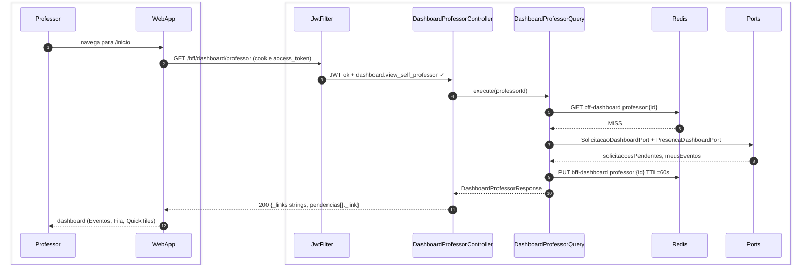
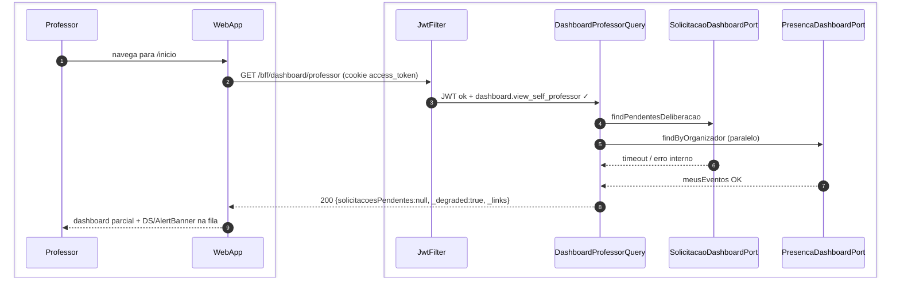

# US-F3-001 — Dashboard do Professor

| HU | Tela | Capability | API primária | Fonte |
|----|------|------------|--------------|-------|
| US-F3-001 | F3.1 — `/inicio` | `dashboard.view_self_professor` | `GET /bff/dashboard/professor` | `HUs/F3 — Professor/US-F3-001-DASHBOARD.md` · `fluxos_por_perfil.md` §4 F3.1 · `as-built-backend.md` §3 |

---

## Matriz de cobertura

| ID diagrama | Origem (CA / RN / sub-fluxo) | Tipo | Status |
|-------------|------------------------------|------|--------|
| F3.1-D01 | CA-01 · RN-F3.1-01 · RN-F3.1-02 · RN-F3.1-03 · RN-F3.1-04 · RN-F3.1-05 — carregamento inicial (cache MISS) | SEQUENCIA | gerado |
| F3.1-D02 | CA-04 · RN-F3.1-06 — degradação graciosa (módulo solicitações indisponível) | SEQUENCIA | gerado |
| — | CA-02 (KpiCard SLA urgentes — `slaUrgentes < now + 24h`) | DRY | → F3.1-D01 (`kpis.slaUrgentes` calculado pelo BFF antes de retornar) |
| — | CA-03 (evento ativo hoje — badge "Em andamento" + CTA "Operar evento") | DRY | → F3.1-D01 (`meusEventos[].estado=EM_ANDAMENTO` + `_links.operar` na resposta BFF) |
| — | RN-F3.1-01 (estrutura DashboardA — mesma rota `/inicio`, BFF contextual, UI cega a perfil) | DRY | → [`F1/US-F1-001-DASHBOARD.md` F1.1-D01](../F1/US-F1-001-DASHBOARD.md) |
| — | RN-F3.1-02 (KpiRow: pendências deliberar, formativas CAAF, eventos hoje, SLA warnings) | DRY | → F3.1-D01 (`kpis.*` na resposta BFF) |
| — | RN-F3.1-03 (bloco Formativas CAAF condicional por `formative.review`) | DRY | → F3.1-D01 (BFF retorna `formativasCaaf=null` se sem capability; bloco não renderizado) |
| — | RN-F3.1-04 (fila filtrada por `canDeliberate=true` para o professor) | DRY | → F3.1-D01 (query BFF filtra no SELECT) |
| — | RN-F3.1-05 (Meus eventos com `event.manage`; badge "Em andamento" para janela ativa) | DRY | → F3.1-D01 (`meusEventos[].estado` + `_links.operar` HATEOAS) |
| — | Skeleton (DS/Skeleton entre requisição e renderização) | NAO_APLICAVEL | — |
| — | Empty state (arrays vazios — `filaSolicitacoes: []`) | NAO_APLICAVEL | — |
| — | Responsividade (375 / 768 / 1280 px) | NAO_APLICAVEL | — |

---

## Referências DRY

| Padrão | Arquivo canônico |
|--------|-----------------|
| Blueprint DashboardA (mesma estrutura `/inicio` para todos os perfis) | [`F1/US-F1-001-DASHBOARD.md`](../F1/US-F1-001-DASHBOARD.md) F1.1-D01 |
| JWT validation + `dashboard.view_self_professor` FGAC | [`F0/US-F0-001-LOGIN.md`](../F0/US-F0-001-LOGIN.md) F0.1-a (JwtFilter) |
| Outbox dispatcher (notificação async) | [`transversal/10.1-outbox-notificacao.md`](../transversal/10.1-outbox-notificacao.md) |
| BFF aggregation pattern (P7) | `.cursor/skills/fullstack-sequence-diagrams/reference.md` §P7 |

---

## Fora de sequência

| Item | Motivo |
|------|--------|
| Skeleton (DS/Skeleton entre request e render) | Lógica puramente frontend: componente exibido enquanto `isLoading=true` no TanStack Query; sem chamada HTTP adicional. |
| Empty state (`filaSolicitacoes: []` ou `meusEventos: []`) | Mesmo fluxo de F3.1-D01; diferença é só o conteúdo do JSON retornado (arrays vazios). Sem variação de participantes ou mensagens. |
| Responsividade (375 / 768 / 1280 px) | Requisito de layout CSS; sem troca de mensagens entre camadas. |
| Badge SLA (célula em `status/danger` quando `prazo_em < now + 24h`) | Comparação client-side derivada de `kpis.slaUrgentes` já presente na resposta do BFF. |

---

## F3.1-D01 — Carregamento inicial do dashboard (happy path — cache MISS)

**Escopo:** happy path — professor acessa `/inicio`; cache Redis expirado ou ausente  
**Atores:** Professor, WebApp, JwtFilter, DashboardProfessorController, DashboardProfessorQuery, Redis  
**Pré-condições:** professor autenticado com `dashboard.view_self_professor`; cookie `access_token` válido

**Notas:**
- Cache name `bff-dashboard`, chave `professor:{id}`, TTL **60 s**. Sem JPA no BFF.
- `_links` strings (`self`, `novoEvento`, `meusEventos`). Itens de pendência usam `_link`.
- Auth: cookie `access_token` (Bearer fallback). Ports as-built: `SolicitacaoDashboardPort`, `PresencaDashboardPort` (estágio/TCC não estão neste Query).

**Lacunas:** nenhuma.

---

## F3.1-D02 — Degradação graciosa (módulo de solicitações indisponível)

**Escopo:** erro parcial de módulo — CA-04, RN-F3.1-06  
**Atores:** Professor, WebApp, JwtFilter, DashboardProfessorQuery, SolicitacaoDashboardPort, PresencaDashboardPort  
**Pré-condições:** módulo de solicitações lança timeout; presença responde

**Notas:**
- HTTP 200 com `_degraded=true`; bloco degradado **não** vai para Redis.
- Controller omite (delega 1:1). Mesma política de F1.1-D03.

**Lacunas:** nenhuma.
