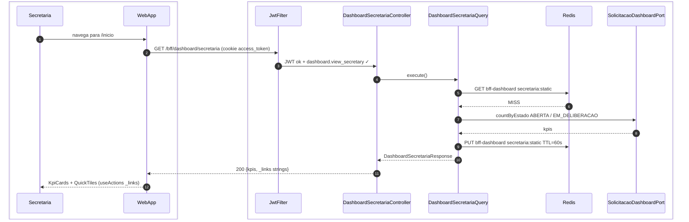
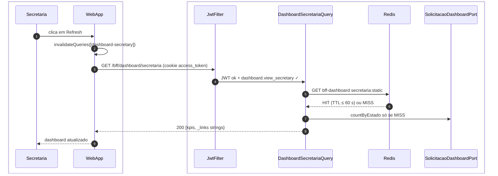

# US-F5-001 — Dashboard Operacional da Secretaria

| HU | Tela | Capability | API primária | Fonte |
|----|------|------------|--------------|-------|
| US-F5-001 | F5.1 — `/inicio` | `dashboard.view_secretary` | `GET /bff/dashboard/secretaria` | `HUs/F5 — Secretaria/US-F5-001-DASHBOARD.md` · `fluxos_por_perfil.md` §6 F5.1 · `as-built-backend.md` §3 |

---

## Matriz de cobertura

| ID diagrama | Origem (CA / RN / sub-fluxo) | Tipo | Status |
|-------------|------------------------------|------|--------|
| F5.1-D01 | CA-F5-001-01 · RN-F5-001-02 · RN-F5-001-03 · RN-F5-001-05 — carregamento inicial (cache MISS) | SEQUENCIA | gerado |
| F5.1-D02 | CA-F5-001-05 · RN-F5-001-08 — refresh manual (cache invalidado) | SEQUENCIA | gerado |
| F5.1-D03 | RN-F5-001-01 — 403 FGAC (acesso sem `dashboard.view_secretary`) | ERRO | gerado |
| — | CA-F5-001-02 (SLA breach — banner `alertasSla[]` + itens `status/danger`) | DRY | → F5.1-D01 (`alertasSla[]` + `filaPriorizada[].sla_status` calculados pelo BFF; renderização client-side) |
| — | CA-F5-001-03 (Empty state — `filaPriorizada: []`) | DRY | → F5.1-D01 (mesmo fluxo HTTP; diferença é apenas `filaPriorizada: []` no JSON retornado) |
| — | CA-F5-001-04 (QuickTiles HATEOAS — tiles condicionais por `_links`) | DRY | → F5.1-D01 (`_links` na resposta BFF → `useActions(_links)` no frontend) |
| — | RN-F5-001-04 (destaque visual breach — `status/danger`) | DRY | → F5.1-D01 (`filaPriorizada[].sla_status` derivado de `prazo_em < now()` no BFF) |
| — | RN-F5-001-06 (Empty state) | NAO_APLICAVEL | — |
| — | RN-F5-001-07 (QuickTiles via `_links`) | DRY | → F5.1-D01 (`useActions` consome `_links` da resposta) |
| — | Skeleton DS/Skeleton (entre request e render) | NAO_APLICAVEL | — |
| — | Responsividade (375 / 768 / 1280 px) | NAO_APLICAVEL | — |

---

## Referências DRY

| Padrão | Arquivo canônico |
|--------|-----------------|
| Blueprint DashboardA (estrutura `/inicio` idêntica para todos os perfis; BFF contextual; UI cega a perfil) | [`F1/US-F1-001-DASHBOARD.md`](../F1/US-F1-001-DASHBOARD.md) F1.1-D01 |
| BFF dashboard professor (mesmo padrão Redis TTL + degradação graciosa) | [`F3/US-F3-001-DASHBOARD.md`](../F3/US-F3-001-DASHBOARD.md) F3.1-D01 |
| JWT validation + FGAC JwtFilter | [`F0/US-F0-001-LOGIN.md`](../F0/US-F0-001-LOGIN.md) F0.1-a |
| BFF aggregation pattern (P7) | `.cursor/skills/fullstack-sequence-diagrams/reference.md` §P7 |
| Outbox dispatcher (notificações assíncronas para a secretaria) | [`transversal/10.1-outbox-notificacao.md`](../transversal/10.1-outbox-notificacao.md) |

---

## Fora de sequência

| Item | Motivo |
|------|--------|
| Skeleton (DS/Skeleton durante `isLoading=true`) | Lógica puramente frontend: componente exibido enquanto TanStack Query aguarda resposta; sem chamada HTTP adicional. |
| Empty state (`filaPriorizada: []`) | Mesmo fluxo HTTP de F5.1-D01; diferença é apenas o conteúdo do JSON (arrays vazios) — sem variação de participantes ou mensagens. |
| Responsividade (375 / 768 / 1280 px) | Requisito de layout CSS; sem troca de mensagens entre camadas. |
| SLA badge visual (`status/danger`, `status/warning`) | Comparação client-side derivada de `filaPriorizada[].sla_status` e `alertasSla[]` já presentes na resposta do BFF. Sem HTTP extra. |
| QuickTiles individuais (Cursos, Alunos, Importações…) | Renderização condicional via `useActions(_links)` sobre a mesma resposta de F5.1-D01; cada tile ausente = `_link` ausente. |

---

## F5.1-D01 — Carregamento inicial do dashboard (happy path — cache MISS)

**Escopo:** happy path — secretária acessa `/inicio`; cache Redis expirado ou ausente  
**Atores:** Secretaria, WebApp, JwtFilter, DashboardSecretariaController, DashboardSecretariaQuery, Redis  
**Pré-condições:** secretária autenticada com `dashboard.view_secretary`; cookie `access_token` válido



**Notas:**
- Path as-built: `/bff/dashboard/secretaria` (não `/secretary`). Cache key **`secretaria:static`** (global, não por userId). TTL 60 s, cache name `bff-dashboard`.
- Query só usa `SolicitacaoDashboardPort` — sem SELECT no BFF. `_links`: `self`, `solicitacoes`, `usuarios` (strings).
- Auth: cookie `access_token` (Bearer fallback).

**Lacunas:** payload HU (filaPriorizada, alertasSla, agendaHoje) **não** está no `DashboardSecretariaResponse` as-built — só KPIs de contagem + `_links`.

**Lacunas:** nenhuma.

---

## F5.1-D02 — Refresh manual (cache invalidado pelo usuário)

**Escopo:** secretária clica no botão Refresh; TanStack Query invalida cache e força nova chamada  
**Atores:** Secretaria, WebApp, JwtFilter, DashboardSecretariaQuery, Redis  
**Pré-condições:** dashboard já renderizado; secretária clica Refresh



**Notas:**
- Invalidate TanStack **não** apaga Redis. HIT pode ter até 60 s de defasagem. Controller omite (delega 1:1).

**Lacunas:** nenhuma.

---

## F5.1-D03 — Erro 403 FGAC (acesso sem `dashboard.view_secretary`)

**Escopo:** usuário sem capability `dashboard.view_secretary` tenta `GET /bff/dashboard/secretaria`  
**Atores:** OutroUsuario, WebApp, JwtFilter, DashboardSecretariaController  
**Pré-condições:** JWT válido; authorities não incluem `dashboard.view_secretary`

```mermaid
sequenceDiagram
    autonumber
    box #e8f4fc Cliente
        participant OutroUsuario
        participant WebApp
    end
    box #fff8ee Servidor
        participant JwtFilter
        participant DashCtrl as DashboardSecretariaController
    end

    OutroUsuario->>WebApp: acessa /inicio (sem dashboard.view_secretary)
    WebApp->>JwtFilter: GET /bff/dashboard/secretaria (cookie access_token)
    JwtFilter->>DashCtrl: JWT ok; dashboard.view_secretary ✗
    DashCtrl-->>WebApp: 403 Problem Details (access_denied)
    WebApp-->>OutroUsuario: redireciona para o dashboard do perfil
```

**Notas:**
- `@PreAuthorize("hasAuthority('dashboard.view_secretary')")` no controller. Sem query a ports.
- Path `/secretaria`, não `/secretary`.

**Lacunas:** nenhuma.
