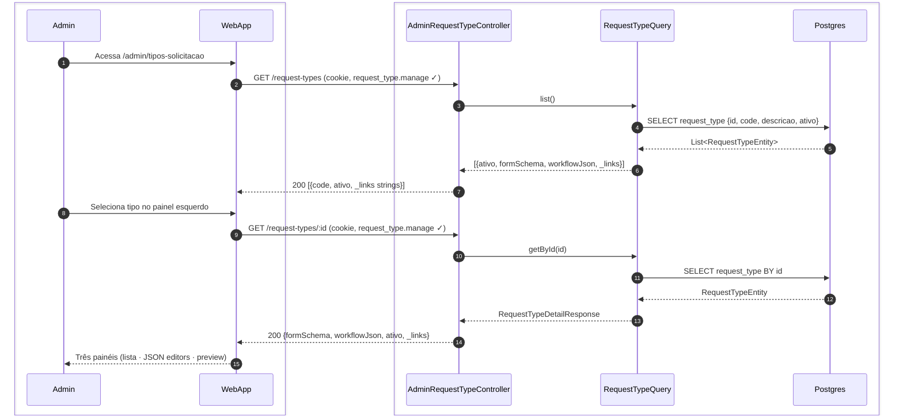
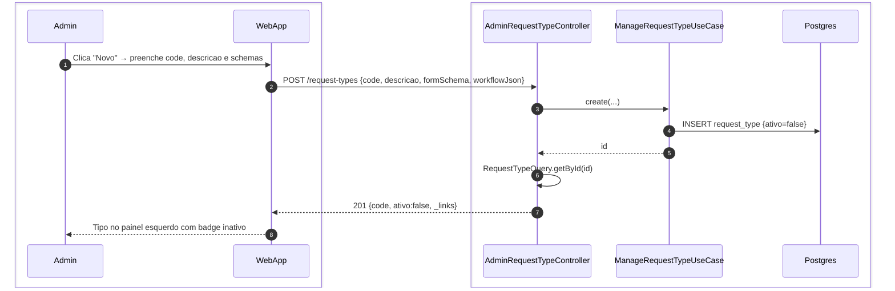
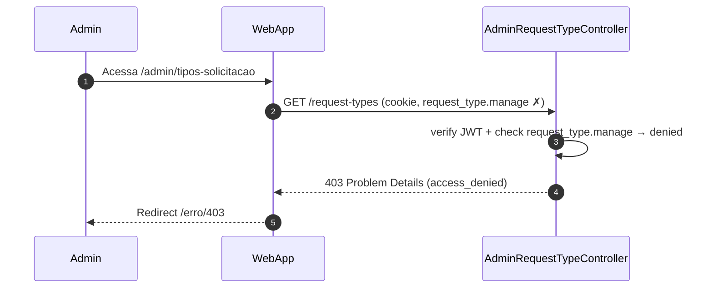
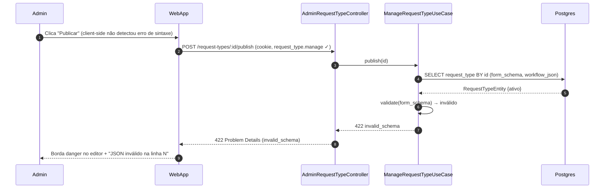
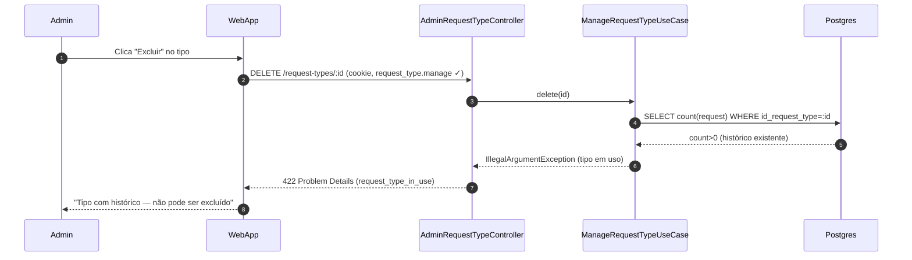

# US-F7-003 — Editor de Tipos de Solicitação (Workflow Engine)

| Campo | Valor |
|-------|-------|
| **HU** | US-F7-003 |
| **Tela** | F7.4 — Tipos de Solicitação |
| **Capability** | `request_type.manage` |
| **API primária** | `GET /request-types` · `POST /request-types` · `PATCH /request-types/:id` · `POST /request-types/:id/publish` · `DELETE /request-types/:id` |
| **Fonte** | `fluxos_por_perfil.md` §8.2 · `US-F7-003-WORKFLOW-ENGINE.md` · ADR-003 · `as-built-backend.md` §4 (ativo boolean, V019 snapshot) |

> ⚠️ **ADR-003 — Coração DRY:** cada `RequestType` publicado aqui substitui múltiplos arquivos de código. Diagramas desta HU cobrem apenas a gestão do catálogo; a execução do workflow (transições de solicitações) está em US-F1-005, US-F3-003, US-F5-002.

---

## Matriz de cobertura

| ID diagrama | Origem (CA/RN) | Classe | Status |
|-------------|----------------|--------|--------|
| F7.4-D01 | CA-01 · RN-01 · RN-02 · RN-11 | SEQUENCIA | gerado |
| F7.4-D02 | CA-07 · RN-08 · RN-10 | SEQUENCIA | gerado |
| F7.4-D03 | CA-02 (persistir rascunho ativo=false) · RN-03 · RN-04 · RN-10 | SEQUENCIA | gerado |
| F7.4-D04 | CA-04 · RN-07 · RN-08 · RN-10 | SEQUENCIA | gerado |
| F7.4-ERRO-01 | CA-01 (403 FGAC) | ERRO | gerado |
| F7.4-ERRO-02 | CA-03 (server-side) · RN-03 | ERRO | gerado |
| F7.4-ERRO-03 | RN-09 (DELETE com histórico) | ERRO | gerado |
| — | CA-02 preview ao vivo | NAO_APLICAVEL | rendering client-side (Monaco + JSON Schema preview) |
| — | CA-03 borda danger | NAO_APLICAVEL | validação client-side no editor; 422 server-side → ERRO-02 |
| — | CA-05 versionamento isolamento | DRY → F7.4-D04 | comportamento interno do publish (RN-07 capturado em D04) |
| — | CA-06 grafo reflete JSON | NAO_APLICAVEL | `DS/WorkflowStateMachineEditor` — re-render client-side |
| — | RN-05 DS/FormSchemaPreview | NAO_APLICAVEL | frontend only — sem chamada backend |
| — | RN-06 DS/WorkflowStateMachineEditor | NAO_APLICAVEL | frontend only — sem chamada backend |

---

## Referências DRY

| Ref | Destino | Motivo |
|-----|---------|--------|
| CA-05 versionamento isolamento | F7.4-D04 (este arquivo) | Solicitações existentes mantêm `id_request_type_version` da abertura — snapshot no publish (V019) |
| F7.4-ERRO-01 (403 padrão) | [`F7/US-F7-001-IAM-USUARIOS.md` F7.1-ERRO-01](US-F7-001-IAM-USUARIOS.md) | Mesmo padrão `@PreAuthorize` — capability `request_type.manage` |
| Execução de transições de workflow | `F1/US-F1-005`, `F3/US-F3-003`, `F5/US-F5-002` | Esta HU cobre o **editor** do catálogo; as transições em runtime (ABERTA → EM_ANALISE → DELIBERADA) estão nas HUs de solicitações |

---

## Fora de sequência

| Item | Motivo |
|------|--------|
| CA-02 — preview ao vivo | `DS/FormSchemaPreview` re-renderiza client-side a cada keystroke (React state); sem chamada backend |
| CA-03 — borda danger | Validação JSON syntax no Monaco Editor (client-side); validação semântica de JSON Schema draft-07 no backend ocorre no publish → F7.4-ERRO-02 |
| CA-06 — grafo reflete JSON | `DS/WorkflowStateMachineEditor` re-renderiza client-side ao atualizar `workflow_json` em memória |
| Execução de sandbox/simulação | Fora de escopo do MVP (RN) |
| Importação de schema via arquivo | Fora de escopo |

---

## F7.4-D01 — Listar tipos e carregar editor de três painéis

**Escopo:** happy path — admin acessa `/admin/tipos-solicitacao`; lista é carregada e o tipo selecionado popula os painéis central e direito  
**Atores:** Admin, WebApp, AdminRequestTypeController, RequestTypeQuery, Postgres  
**Pré-condições:** admin com `request_type.manage`



**Notas:**
- Sem enum `DRAFT`/`PUBLISHED` — coluna `ativo` (boolean). Lista admin inclui rascunhos (`ativo=false`).
- GET **não** pagina nem filtra `?status=` — `RequestTypeQuery.list()` retorna todos.
- `_links` no DTO admin pode estar vazio no as-built (`RequestTypeQuery.toResponse` não monta HAL).
- Wizard do aluno usa `GET /requests/types` (só `ativo=true`), não este path.

**Lacunas:** nenhuma

---

## F7.4-D02 — Criar novo RequestType (POST → ativo=false)

**Escopo:** happy path — admin cria novo tipo; sistema persiste como rascunho (`ativo=false`)  
**Atores:** Admin, WebApp, AdminRequestTypeController, ManageRequestTypeUseCase, Postgres  
**Pré-condições:** admin com `request_type.manage`



**Notas:**
- Create **não** publica — `ativo=false` até `POST /{id}/publish`.
- Tipo inativo não aparece em `GET /requests/types` (wizard F1.8).
- Diagrama relacionado: F7.4-D04 (publicar + snapshot V019).

**Lacunas:** nenhuma

---

## F7.4-D03 — Salvar rascunho (PATCH form_schema + workflow_json)

**Escopo:** happy path — admin edita schemas e persiste sem publicar  
**Atores:** Admin, WebApp, AdminRequestTypeController, ManageRequestTypeUseCase, Postgres  
**Pré-condições:** tipo existente; admin com `request_type.manage`

```mermaid
sequenceDiagram
    autonumber
    box #e8f4fc Cliente
        participant Admin
        participant WebApp
    end
    box #fff8ee Servidor
        participant RTController as AdminRequestTypeController
        participant UC as ManageRequestTypeUseCase
        participant Postgres
    end

    Admin->>WebApp: Edita form_schema / workflow_json → "Salvar"
    WebApp->>RTController: PATCH /request-types/:id {descricao, formSchema, workflowJson}
    RTController->>UC: update(id, ...)
    UC->>Postgres: UPDATE request_type SET form_schema, workflow_json
    UC->>UC: AuditPublisher request_type.update
    RTController-->>WebApp: 200 {formSchema, workflowJson, ativo, _links}
    WebApp-->>Admin: Rascunho salvo; preview atualizado
```

**Notas:**
- As-built **não** exige `ativo=false` no UPDATE — o UseCase atualiza o registro corrente. Publicar (D04) é o que gera snapshot imutável.
- Sem `status='DRAFT'`. `AuditPublisher` (não INSERT audit_log no UseCase).
- Preview client-side a partir da resposta 200.

**Lacunas:** nenhuma

---

## F7.4-D04 — Publicar versão (POST /publish + snapshot V019)

**Escopo:** happy path — admin publica; `ativo=true` + INSERT `request_type_version`  
**Atores:** Admin, WebApp, AdminRequestTypeController, ManageRequestTypeUseCase, Postgres  
**Pré-condições:** `form_schema` e `workflow_json` válidos; admin com `request_type.manage`

```mermaid
sequenceDiagram
    autonumber
    box #e8f4fc Cliente
        participant Admin
        participant WebApp
    end
    box #fff8ee Servidor
        participant RTController as AdminRequestTypeController
        participant UC as ManageRequestTypeUseCase
        participant Postgres
    end

    Admin->>WebApp: Schemas válidos → clica "Publicar"
    WebApp->>RTController: POST /request-types/:id/publish (cookie, request_type.manage ✓)
    RTController->>UC: publish(id)
    UC->>Postgres: SELECT request_type BY id
    Postgres-->>UC: RequestTypeEntity {ativo}
    UC->>UC: validate form_schema + workflow_json
    UC->>Postgres: UPDATE request_type SET ativo=true
    UC->>Postgres: INSERT request_type_version (snapshot V019)
    RTController-->>WebApp: 200 {id, code, ativo:true, _links}
    WebApp-->>Admin: Badge ativo; wizard GET /requests/types vê o tipo
```

**Notas:**
- `RequestTypeVersionStore.snapshot` grava `form_schema` + `workflow_json` imutáveis (V019).
- Solicitações já abertas mantêm `id_request_type_version` da criação (OpenRequestUseCase) — não migram no publish.
- Sem `status='PUBLISHED'` — só `ativo=true`. `AuditPublisher` `request_type.publish`.

**Lacunas:** nenhuma

---

## F7.4-ERRO-01 — 403 FGAC: request_type.manage ausente

**Escopo:** erro — usuário sem `request_type.manage` tenta acessar `/admin/tipos-solicitacao`  
**Atores:** Admin (sem permissão), WebApp, RTController  
**Pré-condições:** token JWT válido; sem `request_type.manage` nas authorities



**Notas:**
- `@PreAuthorize("hasAuthority('request_type.manage')")` — Spring Security rejeita antes do use case
- DRY → [F7.1-ERRO-01](US-F7-001-IAM-USUARIOS.md) — padrão idêntico (`@PreAuthorize` + RFC 7807 403)
- Aplica-se a todos os endpoints desta HU (GET, POST, PATCH, DELETE, POST /publish)

**Lacunas:** nenhuma

---

## F7.4-ERRO-02 — 422 Schema inválido no publish (server-side)

**Escopo:** erro — admin tenta publicar `RequestType` com `form_schema` malformado; API rejeita antes da TX  
**Atores:** Admin, WebApp, RTController, PublishRequestTypeUseCase, Postgres  
**Pré-condições:** tipo `ativo=false` (rascunho) **ou** publicado; `form_schema` com JSON inválido (ex.: chave sem fechar)



**Notas:**
- RFC 7807: `type: invalid_schema`, `status: 422`, `detail: "form_schema: SyntaxError at line N"` — corpo completo em **Notas**
- Mesma lógica aplica-se ao `workflow_json` inválido (tipo: `invalid_workflow`)
- Validação client-side (Monaco) é best-effort — server-side é a barreira definitiva (RN-03)
- Nenhuma TX é iniciada antes do validate — sem efeito colateral

**Lacunas:** nenhuma

---

## F7.4-ERRO-03 — 422 Excluir RequestType com histórico

**Escopo:** erro — admin tenta excluir um `RequestType` que possui solicitações ou versões históricas; API rejeita com 422  
**Atores:** Admin, WebApp, AdminRequestTypeController, ManageRequestTypeUseCase, Postgres  
**Pré-condições:** admin com `request_type.manage`; tipo alvo com solicitações no histórico



**Notas:**
- Delete as-built: **hard DELETE** só se `count(request)=0`. Não é `UPDATE ativo=false`.
- Rascunho não publicado = `ativo=false` (nunca `status=DRAFT`). Tipos em uso não podem ser apagados — desativar no catálogo do wizard é deixar de republicar / não há soft-delete neste UseCase.
- RFC 7807: mensagem "Não é possível excluir tipo com N solicitações no histórico."

**Lacunas:** nenhuma
