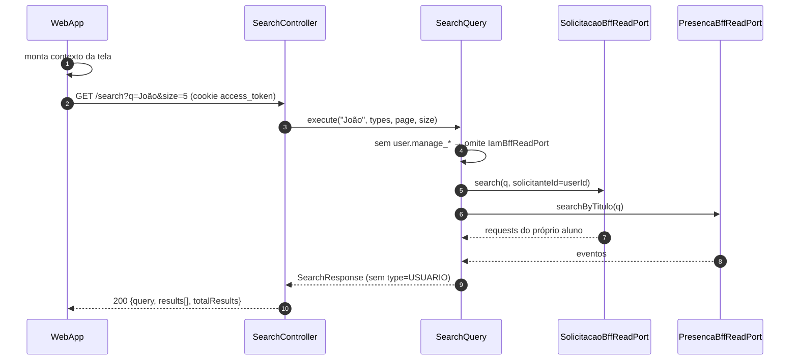

# US-F8-001 — Busca Global (Command Palette)

| HU | Tela | Capability | API primária | Fonte |
|----|------|------------|--------------|-------|
| US-F8-001 | F8.1 — Busca Global | Derivada do token JWT (sem capability fixa) | `GET /search?q=` | `HUs/F8 — Cross-cutting/US-F8-001-BUSCA-GLOBAL.md` |

---

## Matriz de cobertura

| ID diagrama | Origem (CA/RN) | Tipo | Status |
|-------------|----------------|------|--------|
| F8.1-D01 | CA-02, CA-03, RN-02, RN-03, RN-04, RN-05 | SEQUENCIA — happy path (debounce + fan-out + resultados) | gerado |
| F8.1-D02 | CA-04, RN-02, RN-11 | SEQUENCIA — FGAC fan-out (escopo por capability, perfil Aluno) | gerado |
| F8.1-D03 | CA-08, RN-09 (query sem correspondência) | SEQUENCIA — sem resultados (empty state pós-API) | gerado |
| F8.1-D04 | RN-10 | SEQUENCIA — timeout 5s no cliente (AbortController) | gerado |
| — | CA-01, RN-01 (abrir paleta Ctrl+K/⌘K) | NAO_APLICAVEL — evento de teclado puro; sem chamada de API | — |
| — | CA-05, RN-06 (navegação ↑/↓/Enter) | NAO_APLICAVEL — estado DOM; Enter = React Router navigation (client-side) | — |
| — | CA-06 (Esc fechar paleta) | NAO_APLICAVEL — DOM event; sem chamada de API | — |
| — | CA-07, RN-07, RN-08 (layout Desktop modal / Mobile tela cheia) | NAO_APLICAVEL — diferença de renderização UI; API idêntica ao happy path | — |
| — | RN-09 inicial (query vazia ou < 2 chars → EmptyState sem chamada) | NAO_APLICAVEL — estado inicial puramente client-side; sem chamada de API | — |

---

## Referências DRY

Nenhuma — US-F8-001 não replica fluxo de outra HU (busca cross-cutting é único no sistema).

---

## Fora de sequência

| Item | Motivo |
|------|--------|
| CA-01 — abrir paleta com `Ctrl+K` / `⌘K` | Listener de teclado em qualquer tela; sem I/O de rede; comportamento 100% client-side |
| CA-05 — navegação por teclado (↑/↓/Enter) | Gerenciamento de foco e índice de seleção no componente React; Enter dispara `navigate(item.href)` via React Router — não é uma chamada nova ao backend |
| CA-06 — fechar com `Esc` | `onKeyDown` fecha modal e restaura foco; sem chamada de API |
| CA-07 — Mobile tela cheia vs. modal Desktop | Layout condicional baseado em breakpoint (≥768px); a chamada `GET /search` é idêntica nos dois modos |
| RN-06 — dicas de atalho no rodapé (`Main/KeyboardHints`) | Componente estático decorativo |
| RN-07 — dimensões/posição do modal Desktop | CSS puro (max-width 640px, y=302px conforme Figma) |
| RN-08 — Mobile fullscreen header + botão Cancelar | Layout Expo Router / CSS; o botão "Cancelar" apenas faz `router.back()` |
| RN-09 inicial — estado Empty pré-digitação | Renderização condicional baseada em `query.length < 2`; não aciona debounce nem API |

---

## F8.1-D01 — Busca com debounce + fan-out paralelo + resultados agrupados (happy path)

**Escopo:** happy path — usuário digita ≥ 2 chars; API retorna resultados em pelo menos um índice  
**Atores:** Usuário autenticado (qualquer perfil), WebApp, SearchController, SearchQuery  
**Pré-condições:** JWT válido (cookie `access_token`)

```mermaid
sequenceDiagram
    autonumber
    participant Usuário
    participant WebApp
    participant SC as SearchController
    participant Query as SearchQuery
    participant IamPort as IamBffReadPort
    participant ReqPort as SolicitacaoBffReadPort

    Usuário->>WebApp: digita "joão" no DS/CommandPalette (≥2 chars)
    WebApp->>WebApp: debounce 200ms; exibe skeleton Loading
    WebApp->>SC: GET /search?q=joão&size=5 (cookie access_token)
    SC->>Query: execute(q, types, page, size)
    Query->>IamPort: search (se user.manage_*)
    Query->>ReqPort: search (escopo view_own ou view_curso)
    IamPort-->>Query: usuarios[]
    ReqPort-->>Query: requests[]
    Query-->>SC: SearchResponse
    SC-->>WebApp: 200 {query, results[], totalResults}
    WebApp-->>Usuário: DS/SearchResultGroup agrupado por type
```

**Notas:**
- Ports omitidos: `PresencaBffReadPort.searchByTitulo`, `AcademicoReadPort.searchCursos`. Sem Postgres no BFF.
- Params as-built: `q`, `types` (USUARIO,EVENTO,REQUEST,CURSO), `page`, `size` (default 10, max 50) — não há `limit`.
- Índice USUARIO só se `user.manage_students` | `user.manage_all` | `system.admin`. REQUEST sem `request.view_curso`/`request.deliberate` filtra pelo `userId`.
- Controller envolve o Query em `CompletableFuture.get(5, SECONDS)` — timeout 5s no **servidor** (D04 também aborta no cliente).

**Lacunas:** nenhuma.

---

## F8.1-D02 — Fan-out FGAC: escopo por capability (perfil Aluno)

**Escopo:** mesma query `GET /search`, mas com token de **Aluno** — `SearchQuery` omite IAM e restringe REQUEST ao próprio userId  
**Atores:** WebApp (Aluno autenticado)  
**Pré-condições:** JWT com `{request.view_own, event.view}` — sem `user.manage_*`



**Notas:**
- `SearchQuery` não consulta IAM sem capability. REQUEST usa `solicitanteId=user.userId` quando não há `request.view_curso`/`request.deliberate`.
- Tipos: USUARIO, EVENTO, REQUEST, CURSO — não há índice `alunos` separado (aluno entra em USUARIO se o perfil puder buscar usuários).

**Lacunas:** nenhuma.

---

## F8.1-D03 — Sem resultados encontrados (empty state pós-API)

**Escopo:** query válida (≥ 2 chars), porém nenhum índice retorna correspondência → estado EmptyState  
**Atores:** Usuário autenticado, WebApp  
**Pré-condições:** JWT válido; termo buscado sem correspondência em nenhuma tabela

```mermaid
sequenceDiagram
    autonumber
    participant Usuário
    participant WebApp
    participant SC as SearchController
    participant Query as SearchQuery

    Usuário->>WebApp: digita "xyzxyz123" no input (≥2 chars)
    WebApp->>WebApp: debounce 200ms; exibe skeleton Loading
    WebApp->>SC: GET /search?q=xyzxyz123&size=5 (cookie access_token)
    SC->>Query: execute(...)
    Query-->>SC: SearchResponse (results=[])
    SC-->>WebApp: 200 {query, results:[], totalResults:0}
    WebApp-->>Usuário: DS/EmptyState "Nenhum resultado para 'xyzxyz123'"
```

**Notas:**
- Fan-out nos ports igual a D01; diferença só no retorno vazio. HTTP **200** (não 404).
- Query < 2 chars: EmptyState **sem** HTTP (NAO_APLICAVEL).

**Lacunas:** nenhuma.

---

## F8.1-D04 — Timeout 5s no cliente (AbortController)

**Escopo:** erro de rede ou lentidão extrema — cliente cancela a requisição após 5s sem resposta  
**Atores:** Usuário autenticado, WebApp  
**Pré-condições:** JWT válido; rede instável ou backend sobrecarregado (> 5s de latência)

```mermaid
sequenceDiagram
    autonumber
    participant Usuário
    participant WebApp
    participant SearchController

    Usuário->>WebApp: digita "joão" no input (≥2 chars; debounce 200ms)
    WebApp->>SearchController: GET /search?q=joão&size=5 (cookie; timeout 5s)
    WebApp->>WebApp: 5s elapsed sem resposta → AbortController.abort()
    WebApp-->>Usuário: DS/EmptyState + mensagem de erro de rede
```

**Notas:**
- O timeout de 5s é responsabilidade do **cliente** (RN-10): `AbortController` com `signal.timeout(5000)` cancelando o `fetch`. O servidor pode continuar processando após o abort, mas a resposta é descartada.
- O timeout de 5s no cliente (`AbortController`) e o `CompletableFuture.get(5, SECONDS)` no `SearchController` são defesas independentes. Se o servidor vencer, a resposta pode ser `{timedOut:true}`.
- A mensagem de erro exibida pelo WebApp deve orientar o usuário a tentar novamente (não é erro 4xx/5xx do servidor).

**Lacunas:** nenhuma.
