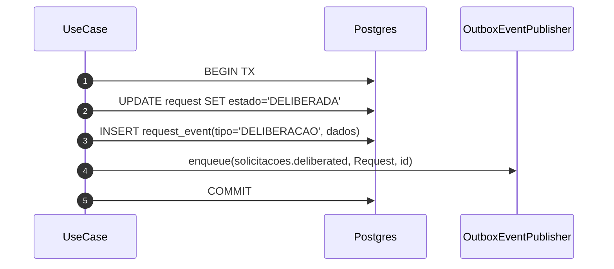
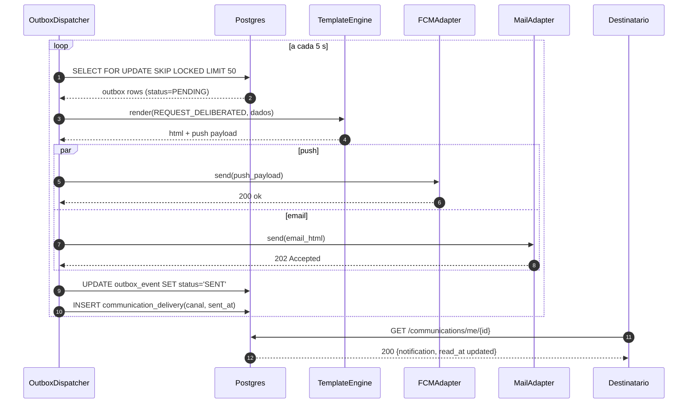

# 10.1 — Outbox: Notificação Ponta-a-Ponta

| ID | Fluxo origem | Tipo | Fonte |
|----|-------------|------|-------|
| 10.1 | `fluxos_por_perfil.md` §10.1 | Transversal async | §10.1 — Fluxo de notificação ponta-a-ponta |

## Matriz de cobertura

| ID diagrama | Origem | Tipo | Status |
|-------------|--------|------|--------|
| 10.1a | §10.1 — Fase TX (commit atômico + OutboxEventPublisher.enqueue) | SEQUENCIA | gerado |
| 10.1b | §10.1 — Fase Dispatch + Notificação ao destinatário | SEQUENCIA | gerado |
| 10.1c | Deep-link `?ott=` → `POST /auth/ott` | SEQUENCIA | gerado |

## Referências DRY

- HUs com tag `OUTBOX`: desenhar apenas a Fase TX local → link `transversal/10.1-outbox-notificacao.md` (10.1b) para o dispatch completo.
- Exemplos de HUs que referenciam este transversal: US-F0-002, US-F3-003, US-F3-004, US-F3-007.

## Fora de sequência

- §10.2 (ciclo de vida da solicitação) e §10.3 (ciclo de vida do evento de presença) são `stateDiagram-v2` — não gerados como `sequenceDiagram`.

---

## 10.1a — Fase TX: commit atômico com outbox (happy path)

**Escopo:** Use Case persiste mutação de negócio e enfileira evento no outbox em única transação atômica.
**Atores:** UseCase, Postgres, OutboxEventPublisher
**Pré-condições:** JWT válido; capability FGAC verificada antes deste ponto; conexão com Postgres disponível.



**Notas:**
- Use cases **não** injetam `OutboxEventJpaRepository`. Enfileiram via port `OutboxEventPublisher.enqueue` na mesma `@Transactional`.
- O adapter do publisher persiste `outbox_event` no COMMIT — se a mutação falhar, o evento não é visível ao dispatcher.
- Substitua `UseCase` por `TransitionRequestUseCase`, `OpenRequestUseCase`, etc.

**Lacunas:** nenhuma.

---

## 10.1b — Fase Dispatch: OutboxDispatcher + envio multicanal (happy path)

**Escopo:** Scheduler (`@Scheduled(fixedDelay=5000)`) drena a fila outbox e envia push + email ao destinatário; destinatário marca notificação como lida.
**Atores:** OutboxDispatcher, Postgres, TemplateEngine, FCMAdapter, MailAdapter, Destinatario
**Pré-condições:** `outbox_event` com `status=PENDING` existe (gerado em 10.1a); templates de notificação cadastrados; tokens FCM registrados.



**Notas:**
- `SELECT FOR UPDATE SKIP LOCKED`: garante que múltiplas instâncias do dispatcher não processem o mesmo evento — idempotência horizontal sem coordenação externa.
- `par push / and email`: canais enviados em paralelo; falha em um canal não bloqueia o outro — cada adapter tem retry próprio com backoff exponencial.
- SLA alvo: fila drenada em < 30 s da transição. Grafana/Mailpit **não** estão no compose as-built 2026-08 — alerta de lag é intenção de design, não runtime atual.
- E-mail de solicitação inclui deep-link `?ott=<jwt>` (`RequestTransitionOutboxHandler`). O cliente **não** faz login com senha nesse link: troca o token em `POST /auth/ott` (10.1c / F0.1-g).
- O template é escolhido pelo `event_type` no outbox.

**Lacunas:** nenhuma.

---

## 10.1c — Destinatário abre e-mail `?ott=` e troca por sessão

**Escopo:** clique no deep-link do e-mail → SPA chama `POST /auth/ott` (cookies; sem tokens no JSON).  
**Atores:** Destinatario, WebApp, AuthController, ExchangeOttUseCase  
**Pré-condições:** e-mail já enviado em 10.1b com URL `/solicitacoes/{id}?ott=JWT`

```mermaid
sequenceDiagram
  autonumber
  box #e8f4fc Cliente
    participant USR as Destinatario
    participant WebApp
  end
  box #fff8ee Servidor
    participant AC as AuthController
    participant UC as ExchangeOttUseCase
  end

  USR->>WebApp: abre /solicitacoes/{id}?ott=JWT
  WebApp->>AC: POST /auth/ott {token}
  AC->>UC: execute(ExchangeOttCommand)
  UC-->>AC: LoginResult (tokens só para Set-Cookie)
  AC-->>WebApp: 200 Set-Cookie + {mustChangePassword, mustAcceptLgpd}
  WebApp-->>USR: sessão; GET /requests/{id} (cookie access_token)
```

**Notas:**
- Replay do mesmo OTT → F0.1-h (401). Rate limit igual ao login → F0.1-d.
- Detalhe Redis/JTI: `F0/US-F0-001-LOGIN.md` F0.1-g.

**Lacunas:** nenhuma.
